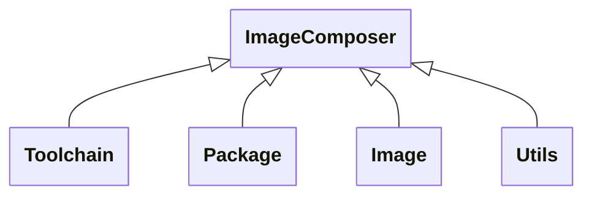
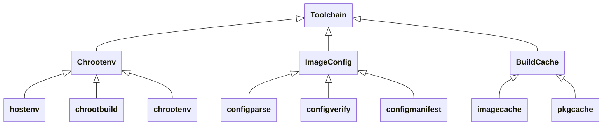
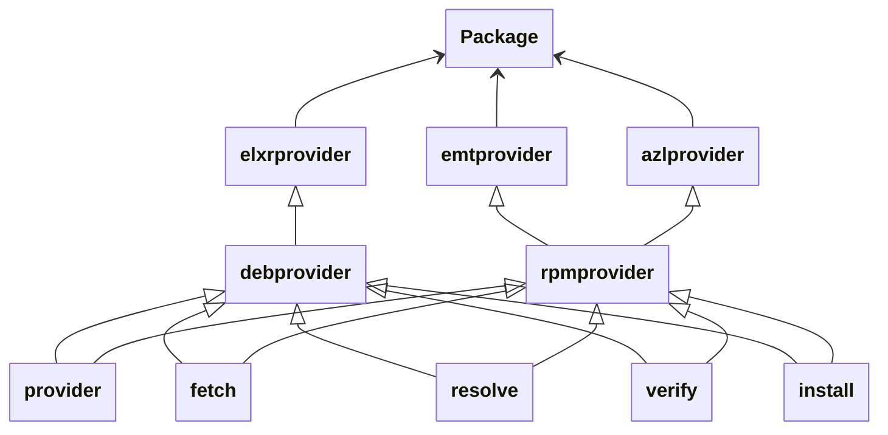
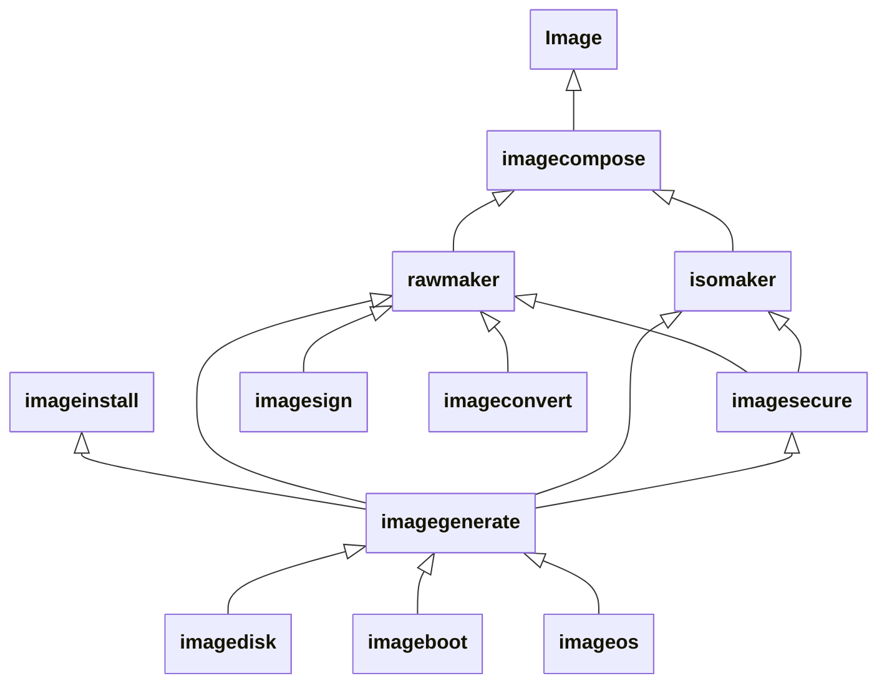

# OS Image Composer Architecture

OS Image Composer is a generic toolkit to build operating system
images from pre-built artifacts such as `rpm` and `deb` in order to support a range of
common operating systems for the distributed edge. You can customize the content of the operating system to suit your requirements, applications, and workloads. 

## Contents

- [Supported Distributions](#supported-distributions)
- [Overview](#overview)
- [OS Image Composer System Network Context](#os-image-composer-system-network-context)
    - [Network Security Considerations](#network-security-considerations)
    - [Package Sign Verification](#package-sign-verification)
- [Components Overview](#components-overview)
    - [Toolchain](#toolchain)
    - [Package](#package)
    - [Image](#image)
    - [Utilities](#utilities)
- [Operational Flow](#operational-flow)
- [Related Documentation](#related-documentation)

## Supported Distributions

The OS Image Composer tool will initially support the following Linux distributions:

* [Edge Microvisor Toolkit](https://github.com/open-edge-platform/edge-microvisor-toolkit) 3.0
* [Azure Linux](https://github.com/microsoft/azurelinux) 3.0
* [Wind River eLxr](https://www.windriver.com/blog/Introducing-eLxr)

## Overview

The OS Image Composer tool generates an image based on a user-customized YAML input file that defines the customizations for a supported OS distribution. Multiple operating systems are supported by the corresponding configuration files. And a set of default image config files per OS distribution helps you get rid of being trapped in the details of OS system configurations. The user input YAML file can be simply nothing configured or full detailed configurations. During the image generation, the final config JSON file is based on the default JSON config and updated according to the user-customized YAML file.

The pre-built artifacts such as those for `rpm` and `deb` come from their corresponding target operating system's remote repository. The OS Image Composer tool implemented the common abstracted package provider interface to fetch packages and solve dependencies from those remote package repositories. To download packages, the OS Image Composer tool securely fetches packages from the distribution-specific package repository and automatically resolves and installs dependencies.

The runtime storage includes the isolated chroot build environment (the rootfs entry for the target operating system), which is the image-generation workspace, the package caches, and the image caches as well as the runtime configuration files and logs.

The supported output image types include raw images and ISO images for bare metal systems and virtual machines. 

The following diagram shows the input and output of the OS Image Composer tool: 

## OS Image Composer System Network Context

The following diagram shows the network context of the OS Image Composer tool:

.

The diagram illustrates how different components of the product's system architecture communicate with each other.

### Network Security Considerations
The OS Image Composer tool downloads required packages using HTTP requests to the distribution specific package repos over TLS 1.2+ connections. Each of the package repos does server-side validation on the package download requests so it is expected that the system running the OS Image Composer tool is provisioned with a CA root chain.

### Package Sign Verification
When packages are downloaded, they are verified for integrity by using the GPG Public Keys and SHA256/MD5 checksum published at the package repositories.

## Components Overview

The following diagram outlines the high-level components of the OS Image Composer tool: 

The tools for composing an image fall into three general groups: the toolchain, package, and image. For modularity, each group contains a set of the components for the OS Image Composer tool's functions. The toolchain libraries focus on building and setting up the image build workspace. The package libraries include the package providers for each supported operating system. And the image libraries provide the general functions to build OS images.

### Toolchain

The host system should be running a validated and supported Linux distribution
such as Ubuntu 24.04. The OS Image Composer tool implements all the common business
logic, which remains the same regardless of which distribution you are building
an image for. Providers exists for the supported operating systems with a
interface definition that each provider needs to implement to decouple
distribution-specific functionality from the core and common business logic.

The OS Image Composer tool generates a `chroot` environment, which is used for
the image composition and creation process which is isolated from the host
operating file system. Packages are fetched, with help from a provider, and
cached locally before the image is created.

| SW Component | Description |
| -------- | ------- |
|hostenv|Detect host OS info and install tool dependencies.|
|chrootbuild|Build the chrootenv tarball for the target OS.|
|chrootenv|Set up chrootenv and initialize the local package cache for the target OS.|
|configparse|Parse and verify the target OS and then generate the full JSON configuration for the image.|
|configverify|Validate the full config with a JSON schema.|
|configmanifest|Generate a manifest file for the target image.|
|imagecache|Build output image cache handling.|
|pkgcache|Pre-fetch packages cache handling.|

### Package

Package is the libraries that provide the unified interface of the operating system vendors' remote package repositories. Given a package list, it analyzes the dependencies of the packages and downloads all the packages and the dependencies from the target operating system's remote package repository to a local cache.

As packages are downloaded, it also verifies the signature of the packages to make sure it obtains the authenticated packages from the certificated repository. It also provides the unified interface to install the packages and the dependencies in the correct order into the image rootfs directory.

| SW Component | Description |
| -------- | ------- |
|elxrprovider|Package provider specific for Wind River elxr.|
|emtprovider|Package provider specific for Edge Microvisor Toolkit.|
|azlprovider|Package provider specific for Azure Linux.|
|debprovider|Generic package provider for debian package repository.|
|rpmprovider|Generic package provider for RPM package repository.|
|provider|Package provider abstract libraries, define the functions|
|resolve|Package provider dependency solving library.|
|fetch|Package provider pkg downloading library.|
|verify|Package provider repo & pkg signature verify library.|
|install|Package provider pkg installation library.|

### Image

Image is the libraries that generate the image; its components are divided according to the generic processing flow. It creates and configures the required raw or ISO images according to an image configuration JSON file.

| SW Component | Description |
| -------- | ------- |
|imagecompose|The top-level library that analyzes the CLI input parameters and then calls specific functions from the underlying libraries.|
|rawmaker|Library to generate the RAW image.|
|isomaker|Library to generate the ISO image.|
|imagegenerate|Core library for image generation.|
|imagesecure|Core library for the image immutability configurations.|
|imagesign|Library for the image signing.|
|imageconvert|Library for the raw image converting.|
|imageinstall|Execution binary for the OS installation within the ISO installer image.|
|imagedisk|Library for the disk partition creation and file system formatting.|
|imageboot|Library for the bootloader configurations.|
|imageos|Library for the general OS system configurations.|

### Utilities
OS Image Composer and its providers use several common `packages`, such as those for logging. Those internal libraries are used by the toolchain, package, and image libraries.

## Operational Flow

The following diagram illustrates the overall image composition flow.

```mermaid
flowchart TD
    s@{ shape: stadium, label: "start" }
    s --> A
    A[User YAML Input Configuration] --> B[Input Validation & Identify Target OS]
    B --> C[Generate target image full JSON config & JSON Schema validation]
    C --> D[Package provider get target os remote repo metadata]
    D --> E[Package provider fetches image packages and dependencies]
    F@{ shape: diamond, label: "if chrootenv pre-build tarball exist" }
    E --> F
    F -- N --> G[Package provider fetches chrootenv packages and dependencies]
    G --> H[Build a chrootenv tarball for the target os]
    H --> I[Setup the chrootenv and initial local caches for image packages]
    F -- Y --> I
    I --> J[Create empty image file and attach to the loop device]
    J --> K[Create partitions and format the partition file system]
    K --> L[Mount partitions to the chrootenv and install images packages]
    L --> M[General system configs, bootloader, user account, hostname, etc.]
    M --> N[Security related configurations, selinux, uki, immutability, etc. optional]
    N --> O[Signing related operations. optional]
    O --> P[Convert raw images to other required formats, vhd, vhdx, qcow2, etc.]
    P --> Q[Generate image manifest file, SBOM, etc.]
    Q --> R[Image cache operation. optional]
    e@{ shape: stadium, label: "end" }
    R --> e
```

## Related Documentation

- [Understanding the Build Process](./image-composer-build-process.md)
- [Understanding Templates](./image-composer-templates.md)
- [Multiple Package Repository Support](./image-composer-multi-repo-support.md)
- [OS Image Composer CLI Reference](./image-composer-cli-specification.md)