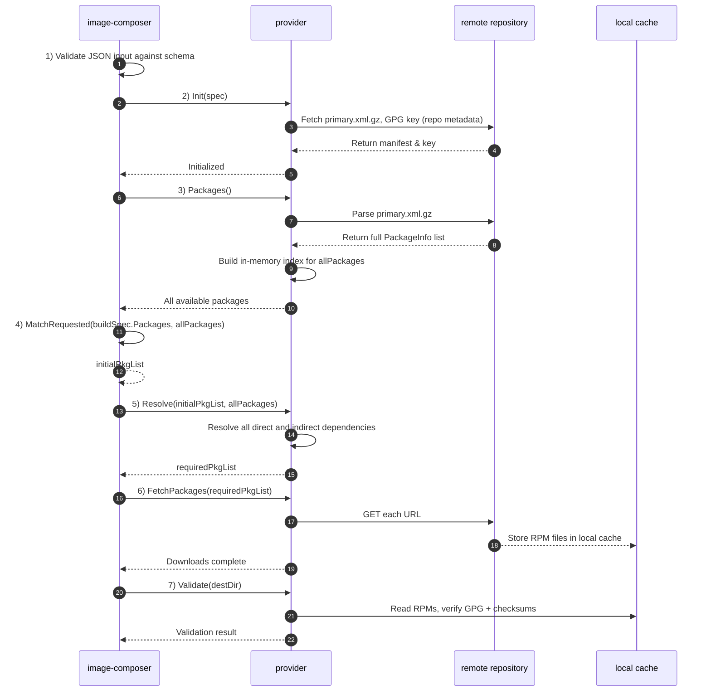

# Understanding the OS Image Composer Build Process

The OS Image Composer tool creates customized OS images through a series of well-defined stages in a build process. Understanding this process helps you optimize your image builds and troubleshoot issues effectively.

## Contents

- [Overview of the Build Pipeline](#overview-of-the-build-pipeline)
- [Build Stages in Detail](#build-stages-in-detail)
  - [1. Validate Stage](#validate-stage)
  - [2. Packages Stage](#packages-stage)
  - [3. Compose Stage](#compose-stage)
  - [4. Image Signing](#image-signing)
  - [5. Finalize Stage](#finalize-stage)
- [Build Configuration Options](#build-configuration-options)
  - [Global Configuration Options](#global-configuration-options)
  - [Build Specification Options](#build-specification-options)
  - [Command-Line Overrides](#command-line-overrides)
- [Common Build Patterns](#common-build-patterns)
  - [Minimal System Image](#minimal-system-image)
  - [Development Environment Image](#development-environment-image)
  - [Production Server Image](#production-server-image)
- [Build Performance Optimization](#build-performance-optimization)
  - [Improving Build Speed](#improving-build-speed)
  - [Reducing Build Time for Development](#reducing-build-time-for-development)
- [Troubleshooting Build Issues](#troubleshooting-build-issues)
  - [Common Problems and Solutions](#common-problems-and-solutions)
  - [Detailed Debugging](#detailed-debugging)
  - [Build Log Analysis](#build-log-analysis)
- [Conclusion](#conclusion)
- [Related Documentation](#related-documentation)

## Overview of the Build Pipeline

The OS Image Composer takes a staged build approach that splits the image creation process into discrete phases --- an architecture with several distinct advantages:

- **Modularity**: Each stage performs a discrete function.
- **Caching**: Intermediate results can be cached for performance to optimize build-generation time, fetching only required packages without rebuilding the chroot environment unless required.
- **Flexibility**: Stages can be limited for debugging or skipped because the tool automatically executes only those  stages required by the current state of the tool's workspace; the tool automatically skips steps that were previously completed for a given distribution.
- **Extensibility**: New capabilities can be added to each stage. After the build process configures an image, you can add your own custom scripts to further customize the image with, for example, network and policy settings.

The build process processes a build specification file through a series of
stages, each building upon the work of the previous stage. A build specification
(or build spec) is a YAML file that defines all the requirements and configurations
for creating a custom OS image.

## Build Stages in Detail

The build process is divided into five sequential stages, each with its own responsibility:

### 1. Validate Stage

The purpose of this stage is to ensure that the build specification is correct syntactically and valid for the targeted provider before starting the build. Here are the stage's key tasks: 

- Parse and validate the YAML specification syntax. YAML is converted to JSON
and validated against a JSON schema definition.
- Verify that the referenced provider exists and is properly configured.
- Check for the existence of required files, such as custom scripts or
configuration files.
- Validate that the combination of settings is valid.
- Ensure that any specified templates exist and can be rendered properly.

**Failure handling**: If validation fails, the build is aborted immediately. Errors are reported with details to help fix the issue. Here's an example of some error messages: 

```bash
Error: Missing required file './files/sshd_config' referenced in build spec
Error: Provider 'ubuntu' is not configured in the global configuration
Error: Invalid combination of compression 'gzip' with format 'vhd'
```

To validate a build specification without building it, see [Validate Command](./image-composer-cli-specification.md#validate-command).

### 2. Packages Stage

This stage collects all the packages required for the image and prepares them for
installation. Here are the stage's key tasks:

- Determine all the packages that the specification requires.
- Resolve package dependencies.
- Check the package cache for previously downloaded packages.
- Download missing packages.
- Verify package integrity with authenticity and integrity checks.
- Store packages in the cache.

This stage uses package caching to minimize bandwidth and improve build performance. The cache stores downloaded packages for future builds, and the build process reuses previously downloaded packages when it can. You can disable the package cache by using the `--no-package-cache` option. To find out how package caching works and benefits build performance, see [Package Cache](./image-composer-caching.md#package-cache).

**Preparation:** As part of the packaging stage, the OS Image Composer prepares the local environment to start composing the image of the target OS layout. Once this stage has completed, the local environment will have a pre-populated cache containing all the required packages before entering the chroot environment and starting to compose the image. The following distinct steps take place during the packaging stage: 

1. The input build-spec JSON file is verified against the JSON schema definition.
1. The desired distribution provider is created and all of its package manifest is
downloaded.
1. The desired packages in the build spec are validated to exist in the target
distribution.
1. The dependency resolution checker identifies all required dependencies.
1. The required packages are downloaded to the local cache.
1. The authenticity and integrity of every package is validated in
the local cache.

**Dependency resolution:** Direct dependencies (those specified in the build spec) are handled first, and then indirect dependencies (those required by direct dependencies) are resolved automatically. Provider-specific helper libraries are used to resolve these dependencies for rpm and deb packages. 

You can add multiple package repositories to an operating system's build, including proprietary packages or upstream packages pending integration; for more information, see [Multiple Package Repository Support](./image-composer-multi-repo-support.md).




### 3. Compose Stage

The compose stage creates an image. To prepare the disk and filesystem and to install all the packages required to create an image, the compose stage performs the following tasks:  

- Create a raw file and format the partitions and filesystems.
- Create an empty raw file and create partitions according to the configs.
- Format the partitions' filesystem.

The compose stage then installs OS packages and configures the generic system, including its security settings: 

- Run pre-installation scripts.
- Install OS packages, set general system configurations, and perform general OS image installation.
- Configure the base operating system environment.
- Install all the collected packages from the packages stage.
- Configure network settings
- Set up user accounts
- Install and configure SSH keys
- Copy custom files to their destinations
- Enable or disable system services
- Configure bootloader options
- Run post-installation scripts
- Configure security settings such as SELinux, LVM, secure boot, readonly filesystem, etc. 

### 4. Image Signing

The image signing stage signs the image by applying digital signatures for image integrity verification if they are required. For examples of template-based configurations, see [Templates](./image-composer-templates.md#template-examples).

### 5. Finalize Stage

The finalization stage prepares the output format, generates a manifest file and a software bill of materials (SBOM), and stores the image in the cache. 

- Convert the raw image to other the required format.
- Apply compression if specified.
- Convert the raw image to VHD/VHDX/qcow2, etc., according to the user configuration.
- Generate a manifest file and an SBOM.
- Store the image in the image cache if caching is enabled.

**Various output formats** are supported: qcow2, raw, vhd, etc. The format conversion is handled by provider-specific tools, and compression options can be applied to reduce the final image size.

**Image caching** stores the image in the image cache based on a hash of the build
spec so you can instantly retrieve identical builds in the future. You can disable image caching by using the `--no-image-cache` option. To find out how to cache and reuse finished images, see [Image Cache](./image-composer-caching.md#image-cache). 

## Build Configuration Options

The build process can be customized with various configuration options.

### Global Configuration Options

Specified in the global configuration file, the following options affect all builds:

```yaml
core:
  cache_dir: "/var/cache/image-composer"     # Cache location
  work_dir: "/var/tmp/image-composer"        # Temporary build directory
  max_concurrent_builds: 4                   # Parallel build processes
  cleanup_on_failure: true                   # Auto-cleanup on build errors

storage:
  package_cache: 
    enabled: true                            # Master switch for package caching
    max_size_gb: 10                          # Maximum package cache size
    retention_days: 30                       # Package retention period
  image_cache:
    enabled: true                            # Master switch for image caching
    max_count: 5                             # Number of images to keep per spec
```


For a list of configuration options, see [Global Configuration File](./image-composer-cli-specification.md#global-configuration-file). 

### Build Specification Options

These options are specified in the build specification file and affect that build:

```yaml
build:
  cache:
    use_package_cache: true                  # Whether to use package cache
    use_image_cache: true                    # Whether to use image cache
  stages:                                    # Build stages to include
    - validate
    - packages
    - compose
    - configuration
    - finalize
```

For the complete build specification format, see [Build Specification File](./image-composer-cli-specification.md#build-specification-file). 

### Command-Line Overrides

These options are specified on the command line and override both global and
specification options:

```bash
# Disable all caching for this build
image-composer build --no-cache my-image-spec.yml

# Build only up to the configuration stage
image-composer build --stage configuration my-image-spec.yml

# Skip the validate stage (not recommended in production)
image-composer build --skip-stage validate my-image-spec.yml

# Set a maximum build duration
image-composer build --timeout 30m my-image-spec.yml
```

For a list of all the command-line options, see [Build Command](./image-composer-cli-specification.md#build-command). 

## Common Build Patterns

### Minimal System Image

Here's an example YAML file for creating small, lean images with minimal packages:

```yaml
image:
  name: minimal-system
  base:
    os: ubuntu
    version: 22.04
    type: minimal

customizations:
  packages:
    install:
      - openssh-server
    remove:
      - snapd
      - cloud-init
```

### Development Environment Image

Here's an example of how to create images with development tools preinstalled:

```yaml
image:
  name: dev-environment
  base:
    os: ubuntu
    version: 22.04
    type: server

customizations:
  packages:
    install:
      - build-essential
      - git
      - docker-ce
      - python3-dev
```

### Production Server Image

Here's an example of how to create hardened production server images:

```yaml
image:
  name: production-web-server
  base:
    os: ubuntu
    version: 22.04
    type: server

customizations:
  packages:
    install:
      - nginx
      - ufw
      - fail2ban
  services:
    enabled:
      - nginx
      - ufw
      - fail2ban
  files:
    - source: ./files/hardened-sshd_config
      destination: /etc/ssh/sshd_config
    - source: ./files/ufw-config
      destination: /etc/ufw/ufw.conf
```

To create templates for your patterns, see [Template Examples](./image-composer-templates.md#template-examples). 

## Build Performance Optimization

The tool lets you optimize build performance to suit your environment and objectives: 

### Improving Build Speed

**Enable caching**: Both the package and image caching significantly improve build performance: Caching packages speeds up similar builds, and caching images makes identical builds instant. See [Package Cache and Image Cache](./image-composer-caching.md#how-they-work-together).

**Increase parallelism**: You can use the `--parallel` option to utilize multiple CPU cores and adjust it to your CPU resources.

**Optimize the working directory**: You should make sure there is adequate free space, and you can place the working directory on fast storage (SSD).

### Reducing Build Time for Development

**Build to specific stages**: Use the `--stage` option to build only up to a particular stage, which is useful for testing changes in early stages.

**Use templates**: Create templates for common configurations, and derive new builds from templates to avoid repetitive configuration. To learn more about streamlining development with templates, see [Template Usage](./image-composer-templates.md#using-templates-to-build-images).

**Keep temporary files**: Use `--keep-temp` during development to avoid rebuilding from scratch and examine temporary files to debug issues. 

## Troubleshooting Build Issues

### Common Problems and Solutions

1. **Build Fails During Validate Stage**:
   - Check the build specification syntax.
   - Verify that all referenced files exist.
   - Make sure the provider is properly configured.

2. **Build Fails During Packages Stage**:
   - Check network connectivity.
   - Verify repository URLs are correct.
   - Make sure package names are correct.
   - Try running with `--no-package-cache` to force fresh package downloads.

3. **Build Fails During Compose Stage**:
   - Ensure there is enough disk space in the working directory.
   - Check provider tool installation (debootstrap, yum, etc.).
   - Verify that the base OS version is supported.

4. **Build Fails During Configuration Stage**:
   - Check custom script exit codes.
   - Verify file paths and permissions.
   - Look for conflicts in package configurations.

5. **Build Fails During Finalize Stage**:
   - Ensure output directory is writable.
   - Check for sufficient disk space.
   - Verify output format tools are installed.

### Detailed Debugging

1. **Increase logging verbosity**:

   ```bash
   image-composer --log-level debug build my-image-spec.yml
   ```

2. **Preserve temporary files**:

   ```bash
   image-composer build --keep-temp my-image-spec.yml
   ```

3. **Run to a specific stage**:

   ```bash
   image-composer build --stage compose my-image-spec.yml
   ```

4. **Skip caching**:

   ```bash
   image-composer build --no-cache my-image-spec.yml
   ```

See [Troubleshooting](./image-composer-cli-specification.md#troubleshooting) for CLI-specific troubleshooting techniques.

### Build Log Analysis

Build logs can provide valuable information about failures. Here are the key sections to check:

1. **Validation errors**: Look for "Validation error" messages at the beginning.

2. **Package resolution issues**: Look for "Failed to resolve dependencies" or "Package not found."

3. **Disk space warnings**: Watch for "Insufficient disk space" messages.

4. **Script execution failures**: Check for "Script returned non-zero exit code."

5. **Permission problems**: Look for "Permission denied" errors.

## Conclusion

The OS Image Composer build process provides a flexible, staged approach to
creating customized OS images. By understanding each stage and its purpose, you
can create more efficient build specifications, troubleshoot issues more
effectively, and optimize the build process for your needs.

Key Takeaways:

1. **Staged architecture**: The build process is broken into distinct stages
that can be controlled individually.
2. **Caching system**: Both package and image caching improve performance
significantly.
3. **Customization options**: Multiple levels of configuration give you precise
control.
4. **Troubleshooting tools**: Various command-line options facilitate debugging
and problem-solving.

## Related Documentation

- [Understanding Caching](./image-composer-caching.md)
- [Multiple Package Repository Support](./image-composer-multi-repo-support.md)
- [Understanding Templates](./image-composer-templates.md)
- [OS Image Composer CLI Reference](./image-composer-cli-specification.md)
