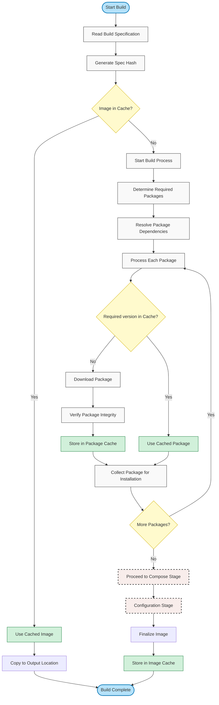

# Understanding Caching in OS Image Composer

## Contents

- [Overview of the Caching Mechanisms](#overview-of-the-caching-mechanisms)
- [Package Cache](#package-cache)
    - [How the Package Cache Works](#how-the-package-cache-works)
    - [Package Cache Benefits](#package-cache-benefits)
- [Image Cache](#image-cache)
    - [How the Image Cache Works](#how-the-image-cache-works)
    - [Image Cache Benefits](#image-cache-benefits)
- [How the Package Cache and Image Cache Work Together](#how-the-package-cache-and-image-cache-work-together)
- [Managing the Caches with the CLI](#managing-the-caches-with-the-cli)
    - [List Cached Content](#list-cached-content)
    - [Clean the Caches](#clean-the-caches)
    - [Export or Import Cached Images](#export-or-import-cached-images)
- [Configuration Options](#configuration-options)
    - [Global Configuration](#global-configuration)
    - [Per-Build Specification](#per-build-specification)
    - [Command-Line Overrides](#command-line-overrides)
- [Best Practices](#best-practices)
- [Related Documentation](#related-documentation)

## Overview of the Caching Mechanisms

The OS Image Composer tool implements two complementary caching mechanisms to significantly improve build performance and reduce resource usage: a package cache and an image cache. This document explains how these caching systems work and how to manage them effectively.

OS Image Composer uses a layered caching approach:

| Cache Type | Purpose | Performance Benefit |
|------------|---------|---------------------|
| Package Cache | Stores downloaded OS packages | Reduces network usage and download time |
| Image Cache | Stores complete built OS images | Eliminates the entire build process for identical builds |

To find out how caching integrates with the build process, see [Build Stages in Detail](./image-composer-build-process.md#build-stages-in-detail).

## Package Cache

The package cache stores downloaded OS packages, such as .deb files for a Debian-based Linux distribution or .rpm files for a RPM-based distribution, to avoid downloading them again for future builds.

### How the Package Cache Works

The package cache is organized by package name, version, architecture, and source repository. Each package is stored only once, regardless of how many build specs use it. Timestamps track when each package was last used.

When the build system needs to install a package, it checks the cache before downloading a package. If the package exists in the cache, it uses the cached version. If not, it downloads the package, adds it to the cache, and then uses it.


### Package Cache Benefits

- Dramatically reduces build time for similar images.
- Decreases network bandwidth usage.
- Works even when build specifications change.
- Enables you to build images without internet access if the packages were previously cached.

To find out how the build process uses the package cache, see [Packages Stage](./image-composer-build-process.md#2-packages-stage). 

## Image Cache

The image cache stores built OS images to skip the entire build process if an identical build specification has been built before.

### How the Image Cache Works

Before building an image, the system generates a unique hash based on the entire build specification, and then it checks if an image with that hash exists in the cache. If it finds the hash, it copies the cached image to the requested output location. If it doesn't find the hash, it proceeds with the normal build process. 

If image caching is enabled, the newly built image is stored in the cache. The specification hash serves as the cache key.

### Image Cache Benefits

- Provides instant results for repeated builds of the same image.
- Ensures consistency across builds.
- Enables quick testing of deployment procedures without rebuilding.
- Saves time and effort in CI/CD pipelines and testing environments.

To find out how images are stored in the cache during build completion, see the [final stage of the build process](./image-composer-build-process.md#5-finalize-stage).

## How the Package Cache and Image Cache Work Together

The two caching mechanisms complement each other and operate at different levels:



This approach maximizes performance: With the image cache, identical builds are instant; with the package cache, similar builds benefit from faster package installation. 

The approach also uses resources efficiently by minimizing bandwidth and managing disk space automatically. Because each mechanism can be enabled or disabled independently, you have the flexibility to customize the use of caches to your requirements.

To find out how to control the behavior of the cache, see [Build Configuration Options](./image-composer-build-process.md#build-configuration-options).

## Managing the Caches with the CLI

The OS Image Composer command-line tool includes commands to manage the caching systems.

### List Cached Content

```bash
# List all cached images with metadata
image-composer cache list

# Get detailed information about a specific cached image
image-composer cache info abc123def456
```

### Export or Import Cached Images

```bash
# Export a cached image to a file
image-composer cache export abc123def456 ./my-exported-image.qcow2

# Import an existing image into the cache
image-composer cache import ./my-image.qcow2
```

See also:
- [Cache Command](./image-composer-cli-specification.md#cache-command) for complete cache management options

## Configuration Options

### Global Configuration

The global configuration resides in `config.yaml`:

```yaml
storage:
  package_cache: 
    enabled: true              # Master switch for package caching
    max_size_gb: 10            # Maximum size for package cache
    retention_days: 30         # How long to keep unused packages
  image_cache:
    enabled: true              # Master switch for image caching
    max_count: 5               # Maximum number of images to keep
```

### Per-Build Specification

The per-build specification appears in the build spec YAML:

```yaml
build:
  cache:
    use_package_cache: true    # Whether this build should use package cache
    use_image_cache: true      # Whether this build should use image cache
```

See also:
- [Global Configuration File](./image-composer-cli-specification.md#global-configuration-file) for all available configuration options
- [Command-Line Overrides](./image-composer-build-process.md#command-line-overrides) for additional build options

## Best Practices

1. **Clean the cache regularly**: Consider performing periodic cache cleaning in long-running environments by manually removing the cache directory content. 

1. **Manage version control integration**: Consider clearing the image cache when major version control changes occur to ensure that images are rebuilt when repository content changes significantly.

1. **Optimize for CI/CD**: In CI/CD environments, persist the cache between pipeline runs. Many CI systems support caching directories between jobs.

See also:
- [Build Performance Optimization](./image-composer-build-process.md#build-performance-optimization)
- [Troubleshooting Build Issues](./image-composer-build-process.md#troubleshooting-build-issues)

## Related Documentation
- [Understanding the Build Process](./image-composer-build-process.md)
- [OS Image Composer CLI Reference](./image-composer-cli-specification.md)
- [Understanding Templates in OS Image Composer](./image-composer-templates.md): How to use and create reusable templates
