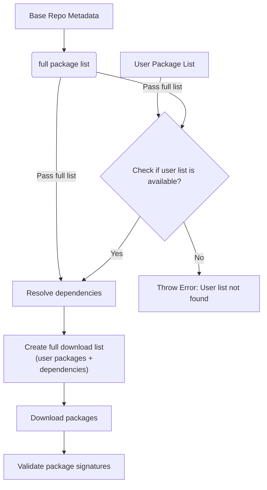
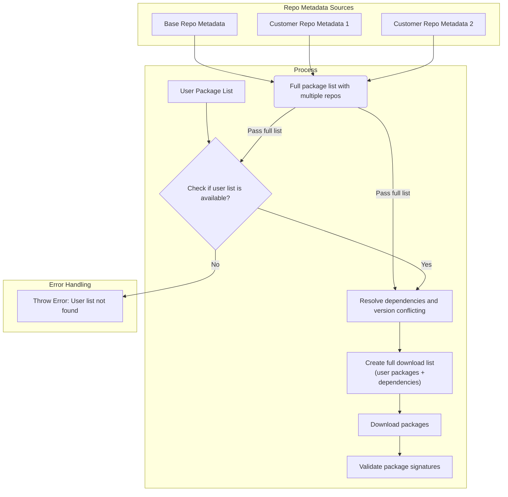

# Image Composer Tool with Multiple Package Repo Support

## Table of Contents
- [Introduction](#introduction)
- [Configuration](#configuration)
- [Package Conflict Priority Consideration](#package-conflict-priority-consideration)
- [Architectural Design](#architectural-design)

---

## Introduction

A major feature of the Image Composer Tool (ICT) is its ability to let users add additional package repositories to the OS build. These repositories often contain in-house proprietary packages or upstream packages pending integration. By supporting multiple repositories, the tool enables rapid deployment, experimentation, and validation of custom software alongside standard OS components.

The following are the key aspects of the Multiple Package Repo:

### Key Features

- **Configuration**: Describes how to add and configure extra package repositories, enabling ICT to access and pull custom packages that are not available in the base repository.
- **Package Conflict Priority Consideration**: Outlines how ICT determines which package to use when duplicates exist across repositories, prioritizing user-specified order and base repository integrity.
- **Architectural Design**: Describes how the design integrates with the tool's existing package and dependency pre-download framework, enabling dependency resolution without relying on package managers like APT or TDNF.

---

## Configuration

Users can specify additional package repositories in the ICT user template, for example:

```yaml
...
additionalrepo:
   intel1: "https://www.intel.com/repo1"  # Add new package repo URL
   intel2: "https://www.intel.com/repo2"  # Add another new package repo URL

packages:
   - intelpackage01   # Package from intel1 repo
   - intelpackage02   # Package from intel2 repo
   - systemd-boot     # Package from base repo
...
```

Each repository must follow the standard Debian or RPM structure, including all required metadata. ICT performs sanity checks to ensure repository URLs are valid before proceeding.

### Repository Setup References
- **Debian repo setup**: https://wiki.debian.org/DebianRepository/Setup  
- **RPM repo setup**: https://wiki.centos.org/HowTos/CreateLocalRepos

---

## Package Conflict Priority Consideration

When multiple repositories contain packages with the same name, ICT uses a simple two-rule priority system for package selection.

### Priority Rules

ICT follows these straightforward rules when resolving package conflicts:

1. **Version Priority**: If the same package exists in multiple repositories with different versions, ICT always selects the package with the latest version number, regardless of which repository contains it.

2. **Repository Order Priority**: If the same package exists in multiple repositories with identical versions, ICT follows this priority order:
   - Base OS repository (highest priority)
   - Additional repositories in the order they appear in configuration

### Resolution Process

```
Decision Flow:
1. Check if package versions differ → Select latest version
2. If versions are identical → Follow repository priority order:
   - Base OS repository
   - intel1 (first additional repo in config)
   - intel2 (second additional repo in config)
   - ... (subsequent repos in config order)
```

### Conflict Resolution Examples

#### Example 1: Different versions across repositories
- Base repo contains: `curl-7.68.0`
- intel1 repo contains: `curl-8.0.1`
- **Result**: ICT selects `curl-8.0.1` from intel1 (latest version rule)

#### Example 2: Same version in multiple repositories
- Base repo contains: `mypackage-1.0.0`
- intel1 repo contains: `mypackage-1.0.0`
- intel2 repo contains: `mypackage-1.0.0`
- **Result**: ICT selects `mypackage-1.0.0` from base repo (repository order priority)

#### Example 3: Mixed scenario
- intel1 repo contains: `testpackage-2.0.0`
- intel2 repo contains: `testpackage-1.5.0`
- **Result**: ICT selects `testpackage-2.0.0` from intel1 (latest version rule)

This simplified priority system ensures users always get the most recent package versions while maintaining predictable behavior for identical versions.

### Dependencies Package

#### What are Dependencies?

In simple terms, dependencies are other packages that a software package needs to work properly. Think of it like cooking a recipe—if you want to make a cake, you need ingredients like flour, eggs, and sugar. Similarly, when you install a software package, it often needs other software packages (dependencies) to function correctly.

**For example:**
- A web browser might depend on graphics libraries to display images
- A media player might depend on codec packages to play different video formats
- A database application might depend on networking libraries to communicate over the internet

#### Dependency Resolution in Multi-Repository Environment

ICT automatically resolves dependencies according to the rules below, ensuring package consistency by keeping parent packages and their dependencies from the same repository.

#### Dependency Resolution Rules

1. **Repository Affinity**: Dependencies are always pulled from the same repository as their parent package, regardless of newer versions available in other repositories.

2. **Fallback to Base Repository**: If a dependency cannot be resolved within the same repository as the parent package (i.e., not found at all), ICT will attempt to resolve the dependency from the base OS repository.

3. **Conflict Prevention**: This approach prevents version mismatches and compatibility issues that could arise from mixing dependencies across different repositories.

4. **Single Version Enforcement**: If different packages require different versions of the same dependency (e.g., package A needs `libtest=0.1` and package B needs `libtest=0.2`), ICT will fail with an error. Multiple versions of the same dependency cannot be installed in parallel.

#### Dependency Resolution Examples

##### Example 1: Parent package with dependencies
- User specifies: `myapp-2.0.0` (available in intel1 repo)
- `myapp-2.0.0` depends on: `libssl-1.1.0` and `libcrypto-1.1.0`
- Base repo contains: `libssl-1.2.0` (newer version)
- intel1 repo contains: `libssl-1.1.0` and `libcrypto-1.1.0`
- **Result**: ICT pulls `libssl-1.1.0` and `libcrypto-1.1.0` from intel1 repo (same as parent)

##### Example 2: Transitive dependencies
- User specifies: `customtools-1.0.0` (from intel2 repo)
- `customtools-1.0.0` → depends on `libxml-2.0.0` (from intel2)
- `libxml-2.0.0` → depends on `zlib-1.2.5` (available in base repo as 1.2.8 and intel2 as 1.2.5)
- **Result**: All dependencies (`libxml-2.0.0`, `zlib-1.2.5`) pulled from intel2 repo

##### Example 3: Fallback to Base Repository
- User specifies: `specialpackage-1.0.0` (from intel1 repo)
- `specialpackage-1.0.0` depends on `missinglib-1.0.0`
- `missinglib-1.0.0` not available in intel1 repo but exists in base repo
- **Result**: ICT pulls `specialpackage-1.0.0` from intel1 repo and `missinglib-1.0.0` from base repo (fallback rule)

##### Example 4: Unresolvable dependency
- User specifies: `anotherpackage-2.0.0` (from intel2 repo)
- `anotherpackage-2.0.0` depends on `unknownlib-3.0.0`
- `unknownlib-3.0.0` not available in any repository
- **Result**: ICT reports dependency resolution failure and suggests adding missing package to the relevant repository or using an alternative

##### Example 5: Conflicting dependency versions
- User specifies: `packageA-1.0.0` (depends on `libtest=0.1`)
- User also specifies: `packageB-2.0.0` (depends on `libtest=0.2`)
- **Result**: ICT fails with an error—multiple versions of `libtest` cannot be installed in parallel. User must resolve the conflict by choosing compatible packages.
- **Alternative Solution**: If both versions of `libtest` are required, users can package each version under a unique package name (e.g., `libtest01` and `libtest02`). This allows both versions to co-exist and satisfy the dependencies for different packages.

#### Benefits of Repository Affinity

- **Consistency**: Ensures all related packages come from the same tested source
- **Compatibility**: Prevents version conflicts between interdependent packages  
- **Predictability**: Users know exactly which repository provides their complete package stack
- **Maintainability**: Simplifies troubleshooting when issues arise with custom packages

This dependency resolution strategy maintains package integrity while supporting the multi-repository architecture.

---

## Architectural Design

The design integrates with ICT's existing package and dependency pre-download framework. The core concept is to build a metadata list of all available packages from a single repository, this list only containing one repo metadata, and using it as a "database" to validate user package requests and resolve dependencies at each subsequence step. The high-level flow is described below:

### Single Repository Flow (Original/Current)



### Multi Repositories Support

The enhanced design extends ICT's package and dependency pre-download framework to support multiple repositories. Instead of building a metadata list from a single source, ICT aggregates metadata from all configured repositories into a unified package database. This consolidated list enables validation of user package requests and accurate dependency resolution across repositories. The high-level flow remains similar, but now operates on combined metadata, ensuring seamless multi-repo support. The high-level flow is described below:

### Multiple Repository Flow (Enhanced)



### Benefits of the Design

1. **Framework Compatibility**: The design adheres to ICT's current package downloading framework, ensuring seamless integration with subsequent image build steps without disrupting existing workflows.

2. **Minimal Code Changes**: The implementation maximizes code reuse by extending existing logic with multi-repository support, making changes atomic and reducing the risk of introducing bugs.

3. **Package Manager Independence**: ICT's package downloading framework remains independent of third-party package managers (such as APT, DNF, etc.), guaranteeing flexibility for future customizations and non-traditional requirements.

4. **Maintainability**: By building upon the existing architecture, the solution reduces complexity and maintains consistency with established patterns, making it easier to maintain and extend.

5. **Backward Compatibility**: The enhanced design preserves full compatibility with single-repository configurations, ensuring existing deployments continue to work without modification.