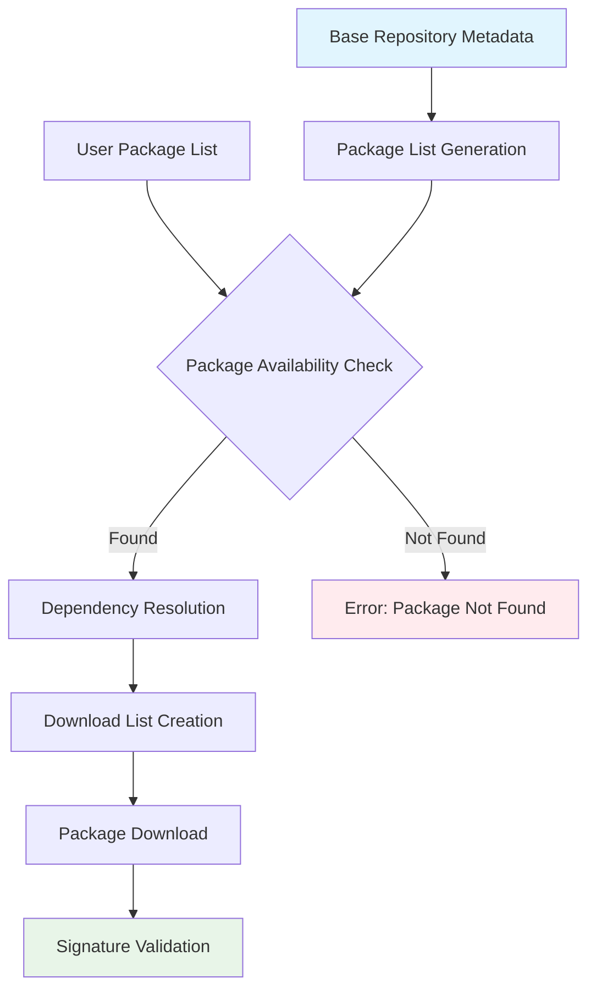
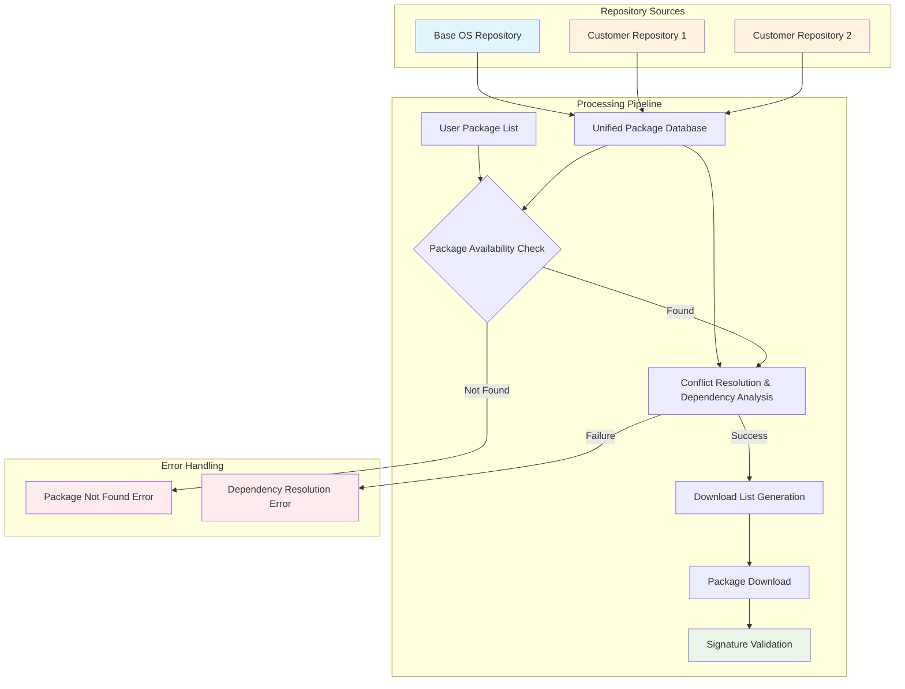

# Image Composer Tool: Multiple Package Repository Support

## Table of Contents
- [Overview](#overview)
- [Key Features](#key-features)
- [Configuration](#configuration)
- [Package Conflict Resolution](#package-conflict-resolution)
- [Dependency Management](#dependency-management)
- [Architectural Design](#architectural-design)
- [Implementation Benefits](#implementation-benefits)

---

## Overview

The Image Composer Tool (ICT) supports multiple package repositories, enabling users to integrate custom, proprietary, or experimental packages alongside standard OS components. This capability facilitates rapid deployment, testing, and validation of custom software in enterprise environments.

---

## Key Features

| Feature | Description |
|---------|-------------|
| **Multi-Repository Configuration** | Add and configure additional package repositories beyond the base OS repository |
| **Intelligent Conflict Resolution** | Automatic package conflict resolution based on version and repository priority |
| **Dependency Management** | Repository affinity ensures dependency consistency and prevents version conflicts |
| **Framework Integration** | Seamless integration with existing ICT package downloading infrastructure |

---

## Configuration

### Repository Setup

Users specify additional repositories in the ICT user template using the following syntax:

```yaml
additionalrepo:
  intel1: "https://www.intel.com/repo1"  # Custom repository 1
  intel2: "https://www.intel.com/repo2"  # Custom repository 2

packages:
  - intelpackage01   # Package from intel1 repository
  - intelpackage02   # Package from intel2 repository
  - systemd-boot     # Package from base repository
```

### Repository Requirements

- **Format**: Repositories must follow standard Debian or RPM structure
- **Metadata**: Complete package metadata must be present
- **Validation**: ICT performs URL and structure validation before processing

### Reference Documentation
- [Debian Repository Setup](https://wiki.debian.org/DebianRepository/Setup)
- [RPM Repository Setup](https://wiki.centos.org/HowTos/CreateLocalRepos)

---

## Package Conflict Resolution

### Priority Rules

When multiple repositories contain identical package names, ICT applies the following resolution strategy:

| Priority | Rule | Description |
|----------|------|-------------|
| **1** | **Version Priority** | Latest version takes precedence regardless of repository |
| **2** | **Repository Order** | For identical versions, follow repository priority order |

### Repository Priority Order

1. **Base OS Repository** (Highest priority)
2. **Additional Repositories** (In configuration order)

### Resolution Examples

<details>
<summary><strong>Example 1: Version Conflict</strong></summary>

```
Scenario: Different package versions across repositories
- Base repo: curl-7.68.0
- intel1 repo: curl-8.0.1
Result: ICT selects curl-8.0.1 (latest version rule)
```
</details>

<details>
<summary><strong>Example 2: Identical Versions</strong></summary>

```
Scenario: Same version in multiple repositories
- Base repo: mypackage-1.0.0
- intel1 repo: mypackage-1.0.0
- intel2 repo: mypackage-1.0.0
Result: ICT selects from base repo (repository priority)
```
</details>

---

## Dependency Management

### Core Principles

> **Repository Affinity**: Dependencies are resolved from the same repository as their parent package to ensure consistency and compatibility.

### Dependency Resolution Rules

| Rule | Description | Benefit |
|------|-------------|---------|
| **Repository Affinity** | Dependencies use same repository as parent package | Prevents version mismatches |
| **Chain Consistency** | Entire dependency tree from single repository | Ensures tested compatibility |
| **Conflict Prevention** | Avoids mixing dependencies across repositories | Maintains package integrity |

### Resolution Examples

#### Example 1: Direct Dependencies
```
Parent Package: myapp-2.0.0 (intel1 repository)
Dependencies: libssl-1.1.0, libcrypto-1.1.0
Available: libssl-1.2.0 in base repo (newer version)
Result: ICT uses libssl-1.1.0 from intel1 (repository affinity)
```

#### Example 2: Transitive Dependencies
```
Package Chain:
customtools-1.0.0 (intel2) → libxml-2.0.0 (intel2) → zlib-1.2.5 (intel2)
Available: zlib-1.2.8 in base repo (newer version)
Result: All packages pulled from intel2 repository
```

#### Example 3: Missing Dependencies
```
Parent: specialpackage-1.0.0 (intel1)
Missing: missinglib-1.0.0 (not in intel1, available in base)
Result: Dependency resolution failure with suggested remediation
```

### Benefits of Repository Affinity

- ✅ **Consistency**: All packages from tested, compatible sources
- ✅ **Predictability**: Clear repository attribution for troubleshooting
- ✅ **Compatibility**: Prevents version conflicts between interdependent packages
- ✅ **Maintainability**: Simplified debugging and package management

---

## Architectural Design

### Current Architecture (Single Repository)



### Enhanced Architecture (Multiple Repositories)



---

## Implementation Benefits

### Technical Advantages

| Benefit | Description | Impact |
|---------|-------------|---------|
| **🔄 Framework Compatibility** | Integrates with existing ICT infrastructure | Zero disruption to current workflows |
| **⚡ Minimal Code Changes** | Extends existing logic rather than replacing it | Reduced development risk and effort |
| **🔧 Package Manager Independence** | No dependency on APT, DNF, or other package managers | Maximum flexibility for custom requirements |
| **📈 Maintainability** | Builds upon established architectural patterns | Simplified long-term maintenance |
| **🔒 Backward Compatibility** | Full support for existing single-repository configurations | Seamless migration path |

### Business Value

- **Accelerated Development**: Rapid integration of custom packages
- **Risk Mitigation**: Isolated testing of experimental packages
- **Operational Flexibility**: Support for diverse repository sources
- **Future-Proofing**: Extensible architecture for evolving requirements

---

## Conclusion

The multi-repository support enhancement maintains ICT's core architectural principles while extending capabilities to support complex enterprise package management scenarios. The design prioritizes compatibility, reliability, and maintainability to ensure successful deployment in production environments.