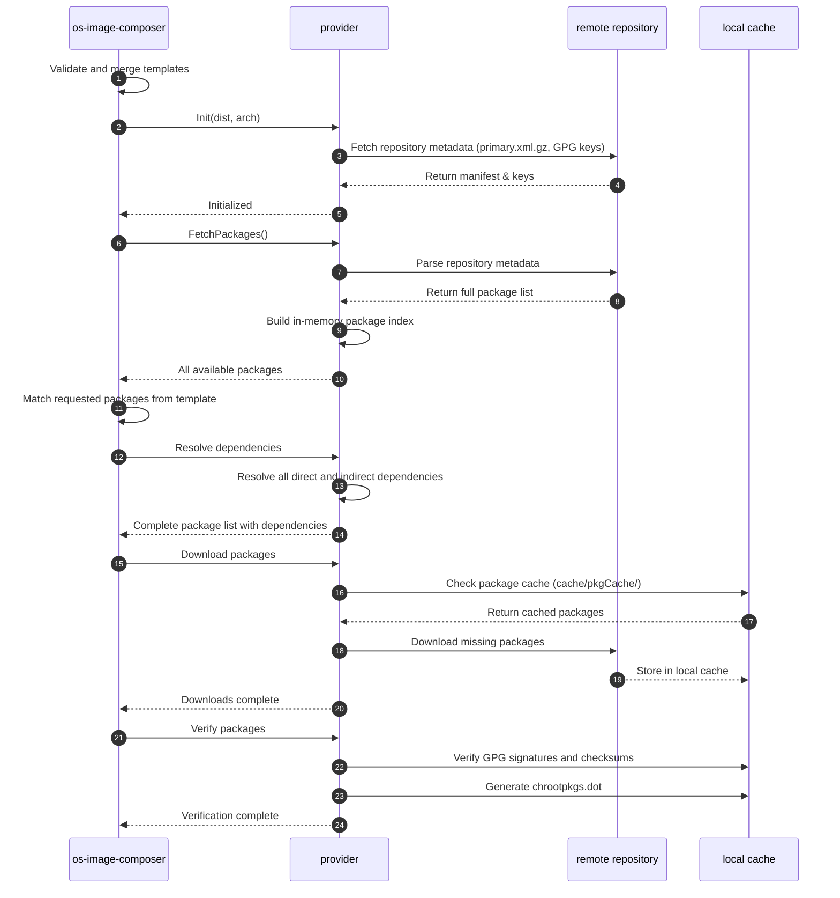

# Understanding the OS Image Composer Build Process

The OS Image Composer tool creates customized OS images through a well-defined build pipeline. Understanding this process helps you optimize your image builds and troubleshoot issues effectively.

## Table of Contents

- [Understanding the OS Image Composer Build Process](#understanding-the-os-image-composer-build-process)
  - [Table of Contents](#table-of-contents)
  - [Overview of the Build Pipeline](#overview-of-the-build-pipeline)
  - [Build Command Workflow](#build-command-workflow)
  - [Build Stages in Detail](#build-stages-in-detail)
    - [1. Template Loading and Validation](#1-template-loading-and-validation)
    - [2. Packages Stage](#2-packages-stage)
    - [3. Compose Stage](#3-compose-stage)
    - [4. Image Signing](#4-image-signing)
    - [5. Finalize Stage](#5-finalize-stage)
  - [Build Configuration Options](#build-configuration-options)
    - [Global Configuration Options](#global-configuration-options)
    - [Default Templates vs Image Templates](#default-templates-vs-image-templates)
    - [Command-Line Overrides](#command-line-overrides)
  - [Common Build Patterns](#common-build-patterns)
  - [Build Performance Optimization](#build-performance-optimization)
    - [Improving Build Speed](#improving-build-speed)
    - [Reducing Build Time for Development](#reducing-build-time-for-development)
  - [Troubleshooting Build Issues](#troubleshooting-build-issues)
    - [Common Problems and Solutions](#common-problems-and-solutions)
    - [Detailed Debugging](#detailed-debugging)
    - [Build Log Analysis](#build-log-analysis)
  - [Conclusion](#conclusion)
  - [Related Documentation](#related-documentation)

## Overview of the Build Pipeline

The OS Image Composer uses a unified build command that processes an image template through a series of well-defined stages. This staged approach provides several advantages:

- **Modularity**: Each stage performs a specific function with clear inputs and outputs
- **Caching**: Intermediate results (packages, chroot environments) are cached for performance
- **Reliability**: Each stage validates its inputs and outputs, catching errors early
- **Extensibility**: New capabilities can be added to each stage independently
- **Transparency**: Detailed logging at each stage helps with debugging and understanding

The build process takes a single YAML image template file as input and produces a bootable OS image in your specified format (raw or ISO). All stages are executed automatically in sequence by the `build` command.

## Build Command Workflow

The [`build` command](./os-image-composer-cli-specification.md#build-command) orchestrates the entire image creation process:

```bash
sudo -E os-image-composer build my-image-template.yml
```

**Internal Workflow:**

1. **Load Configuration** - Load global configuration and command-line overrides
2. **Load and Merge Templates** - Parse user image template and merge with OS-specific default template for the image type and architecture
3. **Initialize Provider** - Select the appropriate provider (Azure Linux, EMT, eLxr) based on template target (OS, distribution, architecture)
4. **PreProcess** - Provider validates template and prepares the build environment
5. **BuildImage** - Provider executes the complete image build pipeline
6. **PostProcess** - Provider performs cleanup and generates SBOM

The provider's `BuildImage` method orchestrates all build stages internally. There is only one `build` command that manages the entire process from template to final image.

## Build Stages in Detail

The `BuildImage` process executes several internal operations to create the final image.

### 1. Template Loading and Validation

**Purpose:** Ensure that the build template is syntactically correct and valid for the target provider before starting the build.

**Key Tasks:**

- Parse and validate YAML template syntax
- Merge user image template with OS-specific default template (e.g., `default-raw-x86_64.yml` or `default-iso-x86_64.yml` from `config/osv/{os}/{dist}/imageconfigs/defaultconfigs/`)
- Validate merged configuration against JSON schema
- Verify that the referenced provider exists and is properly configured
- Check for existence of required files (custom scripts, configuration files, SSH keys)
- Validate that the combination of settings is compatible
- Ensure that any specified custom files exist and are accessible
- Verify bootloader configuration is valid for the target architecture

**Failure Handling:** If validation fails, the build is aborted immediately with detailed error messages to help fix the issue.

**Note:** You can validate a template without building by using the [`validate` command](./os-image-composer-cli-specification.md#validate-command):

```bash
os-image-composer validate my-image-template.yml
```

### 2. Packages Stage

**Purpose:** Collect all required packages and their dependencies, download them, verify integrity, and prepare them for installation.

**Key Tasks:**
1. Determine all packages specified in the merged template
2. Fetch repository metadata from remote package repositories
3. Resolve all direct and indirect dependencies
4. Check the package cache (`cache/pkgCache/{provider-id}/`) for previously downloaded packages
5. Download missing packages from remote repositories
6. Verify package integrity (GPG signatures, checksums)
7. Store packages in the local cache for future builds
8. Generate dependency graph (`chrootpkgs.dot`) for visualization

**Package Cache Benefits:**

The package cache stores downloaded packages (.rpm or .deb files) in `cache/pkgCache/{provider-id}/`. This cache:
- Dramatically reduces build time for similar images
- Decreases network bandwidth usage
- Enables offline builds if packages were previously cached
- Works even when templates change (shared packages are reused)

See [Understanding Caching](./os-image-composer-caching.md#how-package-caching-works) for detailed information about how the package cache works.

**Dependency Resolution:**

Direct dependencies (packages explicitly listed in the template) are processed first, then indirect dependencies (packages required by direct dependencies) are resolved automatically. Provider-specific libraries handle dependency resolution for RPM and DEB package systems.

**Package Resolution Sequence:**



**Multiple Repository Support:**

You can add multiple package repositories to include proprietary packages or upstream packages pending integration. See [Multiple Package Repository Support](./os-image-composer-multi-repo-support.md) for details.

### 3. Compose Stage

**Purpose:** Create the disk image, install all packages, and configure the operating system.

**Key Tasks:**

The compose stage has two main phases:

**Phase 1: Disk/ISO Preparation**

For **raw images**:
- Create an empty raw disk image file in `workspace/{provider-id}/imagebuild/{systemConfigName}/`
- Create partitions according to the disk configuration (boot, root, swap, data, etc.)
- Format partition filesystems (ext4, xfs, vfat, etc.)
- Set up loop devices for partition access

For **ISO images**:
- Create ISO directory structure
- Prepare bootable ISO layout
- Set up isolinux/grub configuration

**Phase 2: OS Installation and Configuration**
- Create or reuse chroot environment from `workspace/{provider-id}/chrootenv/`
  - First build: Creates new chroot environment
  - Subsequent builds: Reuses existing chroot (significant time savings)
- Mount necessary pseudo-filesystems (proc, sys, dev)
- Execute pre-installation scripts (if specified in template)
- Install all packages from the packages stage in correct dependency order
- Configure base OS environment:
  - Set hostname and timezone
  - Configure network settings (interfaces, DNS, routes)
  - Create user accounts and set passwords
  - Install and configure SSH keys
  - Copy custom files to their destinations
  - Enable or disable system services
  - Configure kernel parameters
- Install and configure bootloader (GRUB or systemd-boot)
- Execute post-installation scripts (if specified in template)
- Apply security configurations:
  - SELinux/AppArmor policies
  - dm-verity for read-only filesystem integrity
  - Secure boot configuration
  - Filesystem permissions and hardening
- Clean up temporary files and caches
- Unmount filesystems and detach loop devices

**Chroot Environment Reuse:**

The compose stage works within an isolated chroot environment. Key caching behavior:
- **First build for a provider**: Creates chroot environment in `workspace/{provider-id}/chrootenv/` and tarball in `workspace/{provider-id}/chrootbuild/chrootenv.tar.gz`
- **Subsequent builds**: Reuses existing chroot environment, avoiding the overhead of recreating the base system
- **Image build directory**: `workspace/{provider-id}/imagebuild/{systemConfigName}/` is rebuilt for each build to ensure clean output

This reuse significantly improves build performance, especially when building multiple images for the same OS/distribution/architecture combination.

### 4. Image Signing

**Purpose:** Apply digital signatures to the image for integrity verification and secure boot.

**Key Tasks:**
- Generate or use existing signing keys
- Sign bootloader components (if secure boot is enabled)
- Sign kernel and initrd images
- Generate verification metadata
- Store signature information in image metadata

Image signing is optional and is only performed if configured in the template. See [Understanding Templates](./os-image-composer-templates.md#security-configuration) for signing configuration examples.

### 5. Finalize Stage

**Purpose:** Prepare the final output format, apply compression, and generate metadata.

**Key Tasks:**
- Finalize image format:
  - **raw images**: Copy from workspace to final output location
  - **ISO images**: Create bootable ISO file using genisoimage/mkisofs
- Apply compression if specified (gzip, xz, zstd)
- Generate image manifest file (JSON) containing:
  - Image metadata (name, version, size, format)
  - Package list with versions
  - Build timestamp and configuration hash
- Generate Software Bill of Materials (SBOM) in SPDX format (`tmp/spdx_manifest.json`)
- Copy final image to output location
- Clean up temporary build artifacts from `workspace/{provider-id}/imagebuild/{systemConfigName}/`

**Output Formats:**

The tool supports two primary image types:

| Format | Use Case | Additional Formats | Notes |
|--------|----------|-------------------|-------|
| raw | Bare metal, VMs, cloud deployment | Can be converted to vhd, vhdx, qcow2, vmdk, vdi | Bootable disk image with partitions. Supports compression (gz, xz, zstd) |
| iso | Installation media, live systems | ISO format only | Bootable ISO image |

## Build Configuration Options

The build process can be customized through multiple configuration layers.

### Global Configuration Options

[Global configuration](./os-image-composer-cli-specification.md#global-configuration-file) default stored in root of the repository os-image-composer.yml`:

```yaml
# Worker configuration
workers: 16                                       # Number of concurrent package download workers

# Directory configuration
cache_dir: /var/cache/os-image-composer          # Package cache location
work_dir: /var/tmp/os-image-composer             # Working directory for builds
temp_dir: /tmp                                    # Temporary files location

# Logging configuration
logging:
  level: info                                     # Log level: debug, info, warn, error
  file: /var/log/os-image-composer.log           # Optional log file path
```

### Default Templates vs Image Templates

The OS Image Composer uses a layered configuration approach:

**Default Templates** (`config/osv/{os}/{dist}/imageconfigs/defaultconfigs/`)

These provide OS-specific base configurations that are merged with your image templates:

- `default-raw-{arch}.yml` - Default settings for raw images for specific architecture
- `default-iso-{arch}.yml` - Default settings for ISO images for specific architecture
- `default-initrd-{arch}.yml` - Default settings for initrd images for specific architecture

Located under each OS vendor path, for example:

- `config/osv/azure-linux/azl3/imageconfigs/defaultconfigs/default-raw-x86_64.yml`
- `config/osv/edge-microvisor-toolkit/emt3/imageconfigs/defaultconfigs/default-iso-x86_64.yml`
- `config/osv/wind-river-elxr/elxr12/imageconfigs/defaultconfigs/default-raw-x86_64.yml`

Default templates contain common settings like partition layouts, essential packages, and bootloader configurations. They ensure consistent base configurations across all images of the same OS, distribution, and image type.

**Image Templates** (user-provided YAML files in `image-templates/`)

These are the [templates you create](./os-image-composer-cli-specification.md#image-template-file) to define your specific image requirements. They specify what differs from the defaults:

```yaml
image:
  name: my-custom-image
  version: "1.0.0"

target:
  os: azure-linux      # Operating system provider
  dist: azl3           # Distribution version
  arch: x86_64         # Target architecture
  imageType: raw       # Output format: raw or iso

disk:
  name: Custom_Name    # Maps to systemConfig name
  size: 4GiB

systemConfig:
  name: Custom_Name    # Unique identifier for this configuration
  description: Production server configuration
  packages:
    - openssh-server
    - docker-ce
    - vim
  
  kernel:
    version: "6.12"
    cmdline: "console=ttyS0,115200 console=tty0 loglevel=7"
    packages:
      - kernel-azure
      - kernel-modules-azure

```

**Template Merging Process:**

1. Load OS-specific default template based on `imageType` and `arch` from `config/osv/{os}/{dist}/imageconfigs/defaultconfigs/`
2. Load user-provided image template from `image-templates/`
3. Merge configurations (user image template values override defaults)
4. Validate merged configuration against JSON schema

This layering allows you to specify only what differs from the defaults, making templates concise and maintainable.

See [Understanding Templates](./os-image-composer-templates.md) for complete template documentation and schema reference.

### Command-Line Overrides

[Command-line flags](./os-image-composer-cli-specification.md#global-options) override configuration file settings:

```bash
# Override worker count and cache directory
sudo -E os-image-composer build \
  --workers 32 \
  --cache-dir /mnt/fast-ssd/cache \
  my-template.yml

# Enable verbose logging for debugging
sudo -E os-image-composer build --verbose my-template.yml
```

## Common Build Patterns

The `image-templates/` directory contains example templates for different use cases. Each template is named following the pattern `{os}{dist}-{arch}-{purpose}-{imageType}.yml`, for example:

- `azl3-x86_64-minimal-raw.yml` - Minimal raw disk image
- `elxr12-x86_64-edge-raw.yml` - Edge device optimized image
- `emt3-x86_64-minimal-iso.yml` - Minimal ISO image

These templates demonstrate:

- Different package selections for various use cases
- Disk partitioning schemes (minimal, standard, secure)
- Bootloader configurations (GRUB, systemd-boot)
- Security features (dm-verity, SELinux, immutable root)
- Image artifacts and compression options

Refer to the schema documentation and example templates in `image-templates/` for creating your own custom templates.

## Build Performance Optimization

### Improving Build Speed

**1. Use Package Caching**

Package caching is enabled by default and provides significant performance improvements:
- First build: Downloads all packages (~5-10 minutes depending on package count)
- Subsequent builds: Reuses cached packages (< 1 minute for package stage)

The cache is stored in `cache/pkgCache/{provider-id}/` and is automatically managed.

**2. Leverage Chroot Environment Reuse**

The chroot environment in `workspace/{provider-id}/chrootenv/` is automatically reused:
- First build for a provider: Creates chroot environment (~2-3 minutes)
- Subsequent builds for same provider: Reuses chroot (< 30 seconds)

**3. Optimize Worker Count**

Adjust the worker count based on your system. For example:

```bash
# For systems with fast network and many CPU cores
--workers 32

# For systems with limited network bandwidth
--workers 8
```

**4. Use Local Package Mirrors**

Configure your template to use local package mirrors:

```yaml
repositories:
  - name: local-mirror
    baseurl: http://local-mirror.example.com/packages/
    gpgcheck: true
    gpgkey: http://local-mirror.example.com/RPM-GPG-KEY
```

**5. Use Fast Storage for Cache and Workspace**

Point cache and workspace directories to fast storage (SSD/NVMe):

```bash
--cache-dir /mnt/nvme/cache --work-dir /mnt/nvme/workspace
```

### Reducing Build Time for Development

During development, you can speed up iteration:

**1. Start with Minimal Package Set**

Test your changes with a minimal package list first:

```yaml
packages:
  - filesystem
  - kernel
  - systemd
  # Add only packages you're actively testing
```

**2. Use Verbose Logging Only When Needed**

Normal logging is sufficient for most builds. Use verbose mode only for debugging:

```bash
# Normal build
sudo -E os-image-composer build template.yml

# Verbose only when investigating issues
sudo -E os-image-composer build --verbose template.yml
```

**3. Leverage Reusable Artifacts**

Keep your workspace directory across builds to benefit from chroot reuse:

```bash
# Use consistent work directory
--work-dir /var/tmp/os-image-composer
```

## Troubleshooting Build Issues

### Common Problems and Solutions

**Problem: Build fails during package download**

```
Error: Failed to download package openssh-server
```

**Solutions:**
- Check network connectivity to package repositories
- Verify repository URLs in template are correct
- Check if package name is spelled correctly
- Ensure GPG keys are properly configured
- Try using a different package mirror

**Problem: Insufficient disk space**

```
Error: No space left on device
```

**Solutions:**
- Check available space in work directory: `df -h /var/tmp`
- Check available space in cache directory: `df -h /var/cache`
- Clean up old builds: `rm -rf workspace/*/imagebuild/`
- Clear package cache if needed: `rm -rf cache/pkgCache/`
- Use a different work directory with more space: `--work-dir /mnt/large-disk/workspace`

**Problem: Permission denied errors**

```
Error: Permission denied when creating loop device
```

**Solutions:**
- Run with sudo: `sudo -E os-image-composer build template.yml`
- Ensure user has appropriate permissions
- Check that work directory and cache directory are writable
- Verify SELinux is not blocking operations (if applicable)

**Problem: Package dependency conflicts**

```
Error: Package conflict: package-a requires version 1.0, but version 2.0 is already installed
```

**Solutions:**
- Review your package list for conflicting requirements
- Check if you're mixing packages from incompatible repositories
- Use specific package versions if needed

**Problem: Chroot environment corruption**

```
Error: Failed to enter chroot environment
```

**Solutions:**
- Remove corrupted chroot: `rm -rf workspace/{provider-id}/chrootenv/`
- Remove chroot tarball: `rm -rf workspace/{provider-id}/chrootbuild/`
- Next build will recreate the chroot environment from scratch

### Detailed Debugging

**Enable Verbose Logging:**

```bash
sudo -E os-image-composer build --verbose my-template.yml
```

See the [build command documentation](./os-image-composer-cli-specification.md#build-command) for all available flags.

This provides detailed output for each step:
- Package download progress
- Chroot environment setup
- Command execution within chroot
- Filesystem operations
- Mount/unmount operations

**Generate Dependency Graph:**

```bash
sudo -E os-image-composer build --dotfile deps.dot my-template.yml
dot -Tpng deps.dot -o deps.png
```

The dependency graph is also automatically saved to `cache/pkgCache/{provider-id}/chrootpkgs.dot`.

This visualization helps with:
- Understanding why certain packages are included
- Identifying dependency conflicts
- Optimizing package selection

**Check Build Artifacts:**

Inspect the workspace and cache directories:

```bash
# View chroot environment
ls -la workspace/{provider-id}/chrootenv/

# Check package cache
ls -la cache/pkgCache/{provider-id}/

# Check dependency graph
cat cache/pkgCache/{provider-id}/chrootpkgs.dot

# Examine build directory
ls -la workspace/{provider-id}/imagebuild/{systemConfigName}/

# Check SBOM
cat tmp/spdx_manifest.json
```

### Build Log Analysis

The build process logs important milestones:

```
INFO: Using configuration from: /etc/os-image-composer/config.yml
INFO: Loading template: my-template.yml
INFO: Merging with default template: config/general/default-raw.yml
INFO: Initializing provider: azure-linux-azl3-x86_64
INFO: Starting build process
INFO: [Validate] Validating template against schema
INFO: [Packages] Fetching repository metadata
INFO: [Packages] Resolving dependencies
INFO: [Packages] Downloading packages (0/245 cached)
INFO: [Packages] Verifying package integrity
INFO: [Packages] Generating dependency graph: cache/pkgCache/.../chrootpkgs.dot
INFO: [Compose] Reusing existing chroot environment
INFO: [Compose] Creating raw disk image (10G)
INFO: [Compose] Creating partitions
INFO: [Compose] Formatting filesystems
INFO: [Compose] Installing packages (245 total)
INFO: [Compose] Configuring system
INFO: [Compose] Installing bootloader
INFO: [Finalize] Generating manifest
INFO: [Finalize] Generating SBOM: tmp/spdx_manifest.json
INFO: Build completed successfully
INFO: Output image: workspace/.../my-custom-image-1.0.0.raw
```

Look for ERROR or WARN messages in the log to identify issues.

## Conclusion

The OS Image Composer build process uses a single unified `build` command that internally executes multiple stages to create customized OS images. By understanding the internal build process, you can:

- Create efficient build specifications
- Troubleshoot issues more effectively
- Optimize the build process for your needs
- Leverage caching to improve performance

**Key Takeaways:**

1. **OS-Specific Configuration**: Default templates are organized by OS vendor, distribution, and architecture in `config/osv/`
1. **Template Merging**: OS-specific default templates provide base configuration, user image templates (in `image-templates/`) customize
1. **Caching System**: Package caching and chroot reuse dramatically improve performance
1. **Two Image Types**: `raw` (with format conversion to vhd, vhdx, qcow2, vmdk, vdi) and `iso` for different deployment scenarios
1. **Troubleshooting Tools**: Verbose logging and dependency graphs facilitate debugging

## Related Documentation

- [Understanding Caching](./os-image-composer-caching.md) - Detailed information about package and chroot caching
- [Understanding Templates](./os-image-composer-templates.md) - How to create image templates and schema reference
- [Multiple Package Repository Support](./os-image-composer-multi-repo-support.md) - Adding custom package sources
- [OS Image Composer CLI Reference](./os-image-composer-cli-specification.md) - Complete command-line documentation

<!--hide_directive
:::{toctree}
:hidden:

Caching <os-image-composer-caching>
Templates <os-image-composer-templates>

:::
hide_directive-->