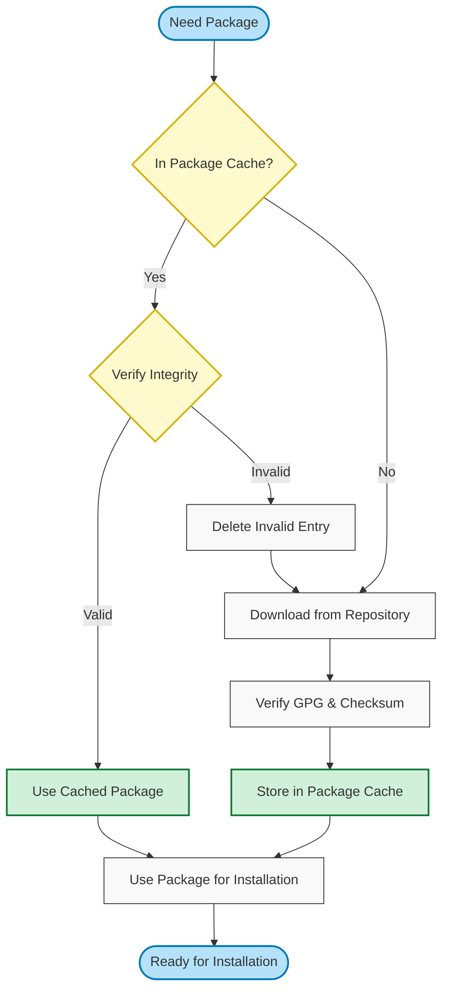

# Understanding Caching in OS Image Composer

The OS Image Composer implements sophisticated caching mechanisms to significantly improve build performance and reduce resource usage. This document explains how caching works and how to manage it effectively.

## Table of Contents

- [Understanding Caching in OS Image Composer](#understanding-caching-in-os-image-composer)
  - [Table of Contents](#table-of-contents)
  - [Overview of Caching Mechanisms](#overview-of-caching-mechanisms)
  - [Package Caching](#package-caching)
    - [How Package Caching Works](#how-package-caching-works)
    - [Package Cache Organization](#package-cache-organization)
    - [Package Cache Benefits](#package-cache-benefits)
  - [Chroot Environment Reuse](#chroot-environment-reuse)
    - [How Chroot Reuse Works](#how-chroot-reuse-works)
    - [Chroot Directory Structure](#chroot-directory-structure)
    - [Chroot Reuse Benefits](#chroot-reuse-benefits)
  - [Cache Integration with Build Process](#cache-integration-with-build-process)
  - [Configuration Options](#configuration-options)
    - [Global Configuration](#global-configuration)
    - [Command-Line Overrides](#command-line-overrides)
  - [Cache Management](#cache-management)
    - [Cache Locations](#cache-locations)
    - [Cache Size Management](#cache-size-management)
    - [Clearing Caches](#clearing-caches)
  - [Best Practices](#best-practices)
  - [Advanced Topics](#advanced-topics)
    - [Cache on Network Storage](#cache-on-network-storage)
    - [Sharing Caches Between Hosts](#sharing-caches-between-hosts)
    - [Cache Performance Tuning](#cache-performance-tuning)
  - [Related Documentation](#related-documentation)

## Overview of Caching Mechanisms

The OS Image Composer uses two complementary caching mechanisms to dramatically improve build performance:

**1. Package Cache** - Stores downloaded OS packages (.rpm or .deb files) for reuse across builds

**2. Chroot Environment Reuse** - Preserves the chroot environment and its tarball to avoid rebuilding the base system

| Cache Type | Purpose | Location | Performance Benefit |
|------------|---------|----------|---------------------|
| Package Cache | Downloaded packages | `cache/pkgCache/{provider-id}/` | Eliminates re-downloading packages |
| Chroot Environment | Base OS environment | `workspace/{provider-id}/chrootenv/` | Avoids recreating chroot for each build |
| Chroot Tarball | Chroot snapshot | `workspace/{provider-id}/chrootbuild/` | Quick chroot restoration |

Together, these mechanisms provide substantial performance improvements:
- **First build**: Creates all artifacts from scratch (10-15 minutes typical)
- **Subsequent builds with cache**: Reuses packages and chroot (2-4 minutes typical)
- **Performance improvement**: 60-80% reduction in build time

## Package Caching

The package cache stores downloaded OS packages locally. Once packages are downloaded and verified, they are stored in the cache and reused for subsequent builds.

### How Package Caching Works

During the packages stage of a build, the tool follows this process:



**Detailed Steps:**

1. **Cache Lookup**: Check if package exists in `cache/pkgCache/{provider-id}/`
2. **Integrity Verification**: Verify cached package hasn't been corrupted
   - Check file size matches expected size
   - Verify SHA256 checksum
   - Validate GPG signature
3. **Cache Hit**: If valid, collect package for installation
4. **Cache Miss/Invalid**: If not in cache or invalid, download from repository
5. **Download and Verify**: Download package and verify integrity
6. **Store in Cache**: Save verified package for future use
7. **Generate Dependency Graph**: Update `chrootpkgs.dot` with dependency information

### Package Cache Organization

The package cache is organized by provider to ensure each unique package is stored only once:

```
cache/
└── pkgCache/
    └── {provider-id}/                    # e.g., azure-linux-azl3-x86_64
        ├── package1-1.0-1.rpm
        ├── package2-2.5-3.rpm
        ├── chrootpkgs.dot                # Dependency graph
        └── [hundreds more packages...]
```

**Provider ID Format**: `{os}-{dist}-{arch}` (e.g., `azure-linux-azl3-x86_64`)

Each package file includes:
- Full package filename with version and architecture
- Stored in a flat directory structure
- Verified GPG signatures and checksums

The `chrootpkgs.dot` file contains a visual representation of package dependencies in Graphviz DOT format, useful for troubleshooting and understanding package relationships.

### Package Cache Benefits

**1. Dramatically Reduced Build Times**

| Build Scenario | Without Cache | With Cache | Improvement |
|---------------|---------------|------------|-------------|
| First build (200 packages) | 8-12 minutes | 8-12 minutes | Baseline |
| Identical rebuild | 8-12 minutes | 2-3 minutes | 70-75% faster |
| Similar build (150 shared packages) | 8-12 minutes | 4-5 minutes | 50-60% faster |
| Minimal changes (5 new packages) | 8-12 minutes | 2-3 minutes | 70-75% faster |

**2. Reduced Network Bandwidth**

- First build: Downloads all required packages (~500MB-2GB typical)
- Subsequent builds: Downloads only new or updated packages (~0-100MB typical)
- Shared packages across different configurations are downloaded once

**3. Offline Build Capability**

If all required packages are cached, you can build images without internet access:
- Useful for air-gapped environments
- Enables builds on systems with restricted network access
- Reduces dependency on repository availability

**4. Consistent Build Performance**

- Build times become predictable after initial cache population
- Less affected by repository server performance
- Reduces impact of network congestion

**5. Development Workflow Efficiency**

- Rapid iteration during development
- Quick testing of configuration changes
- Fast CI/CD pipeline execution

## Chroot Environment Reuse

The chroot environment reuse mechanism preserves the base OS environment between builds, avoiding the expensive overhead of recreating it for each build.

### How Chroot Reuse Works

The tool manages chroot environments at the provider level (OS-distribution-architecture combination):

**First Build for a Provider:**
1. Create base chroot environment in `workspace/{provider-id}/chrootenv/`
2. Install essential packages (filesystem, systemd, kernel, etc.)
3. Configure base system
4. Create tarball snapshot in `workspace/{provider-id}/chrootbuild/chrootenv.tar.gz`

**Subsequent Builds for Same Provider:**
1. Check if chroot environment exists in `workspace/{provider-id}/chrootenv/`
2. If exists and valid, reuse the existing chroot
3. Mount pseudo-filesystems (proc, sys, dev)
4. Install additional packages specific to the image template
5. Configure image-specific settings

**Image Build Directory:**
- Each build creates a clean directory in `workspace/{provider-id}/imagebuild/{systemConfigName}/`
- This directory contains the final image output
- Rebuilt for each build to ensure clean output

### Chroot Directory Structure

```text
workspace/
└── {provider-id}/                        # e.g., azure-linux-azl3-x86_64
    ├── chrootenv/                        # REUSED chroot environment
    │   ├── bin/
    │   ├── boot/
    │   ├── etc/
    │   ├── usr/
    │   ├── var/
    │   └── workspace/
    ├── chrootbuild/                      # REUSED chroot tarball
    │   ├── chroot/
    │   └── chrootenv.tar.gz              # Snapshot for quick restoration
    └── imagebuild/                       # REBUILT each time
        └── {systemConfigName}/           # e.g., production, minimal, edge
            ├── {image-name}.raw
            └── [build artifacts]
```

**Persistence:**
- **chrootenv/**: Persists across builds, contains full chroot filesystem
- **chrootbuild/**: Persists across builds, contains tarball for restoration
- **imagebuild/**: Cleaned and rebuilt for each image build

### Chroot Reuse Benefits

**1. Significant Time Savings**

| Operation | Without Reuse | With Reuse | Improvement |
|-----------|---------------|------------|-------------|
| Chroot creation | 2-3 minutes | ~30 seconds | 75-85% faster |
| Total build time | 10-15 minutes | 3-5 minutes | 60-70% faster |

**2. Reduced Disk I/O**

- Avoids writing hundreds of MB of system files
- Reduces wear on SSDs
- Improves performance on slower storage

**3. Consistent Base Environment**

- Same base environment used across multiple image builds
- Ensures consistency in base system configuration
- Reduces variables when troubleshooting

**4. Resource Efficiency**

- Single chroot environment per provider, not per image
- Efficient use of disk space (shared base, unique images)

## Cache Integration with Build Process

Both caching mechanisms integrate seamlessly with the build pipeline:

```mermaid
flowchart TD
    Start([Start Build]) --> LoadTemplate[Load Template]
    LoadTemplate --> InitProvider[Initialize Provider]
    InitProvider --> Validate[Validate Stage]
    
    Validate --> PackageStage[Packages Stage]
    
    PackageStage --> FetchMeta[Fetch Repository Metadata]
    FetchMeta --> ResolveDeps[Resolve Dependencies]
    ResolveDeps --> PackageLoop[For Each Required Package]
    
    PackageLoop --> CheckPkgCache{In Package Cache?}
    CheckPkgCache -->|Yes| UsePackage[Use Cached Package]
    CheckPkgCache -->|No| DownloadPkg[Download Package]
    DownloadPkg --> StorePkg[Store in Package Cache]
    StorePkg --> UsePackage
    
    UsePackage --> MorePackages{More Packages?}
    MorePackages -->|Yes| PackageLoop
    MorePackages -->|No| Compose[Compose Stage]
    
    Compose --> CheckChroot{Chroot Exists?}
    CheckChroot -->|Yes| ReuseChroot[Reuse Chroot Environment]
    CheckChroot -->|No| CreateChroot[Create New Chroot]
    CreateChroot --> SaveTarball[Save Chroot Tarball]
    SaveTarball --> InstallPackages
    ReuseChroot --> InstallPackages[Install Image Packages]
    
    InstallPackages --> Configure[Configure System]
    Configure --> CreateImage[Create Image File]
    CreateImage --> Finalize[Finalize Stage]
    Finalize --> Done([Build Complete])
    
    %% Styling
    classDef stage fill:#f8edeb,stroke:#333,stroke-width:2px;
    classDef decision fill:#fffacd,stroke:#d4b106,stroke-width:2px;
    classDef cache fill:#d1f0da,stroke:#0e7735,stroke-width:2px;
    classDef process fill:#f9f9f9,stroke:#333,stroke-width:1px;
    classDef endpoint fill:#b5e2fa,stroke:#0077b6,stroke-width:2px;
    
    class PackageStage,Compose,Finalize stage;
    class CheckPkgCache,CheckChroot,MorePackages decision;
    class UsePackage,StorePkg,ReuseChroot,SaveTarball cache;
    class LoadTemplate,InitProvider,Validate,FetchMeta,ResolveDeps,PackageLoop,DownloadPkg,CreateChroot,InstallPackages,Configure,CreateImage process;
    class Start,Done endpoint;
```



**Integration Points:**

1. **Package Stage**: Package cache checked for each required package
2. **Compose Stage**: Chroot environment reused if available
3. **Throughout Build**: Cached artifacts used transparently
4. **Across Builds**: Caches persist and accumulate over time

## Configuration Options

### Global Configuration

Configure cache and workspace locations in `/etc/os-image-composer/config.yml`:

```yaml
# Package cache configuration
cache_dir: /var/cache/os-image-composer  # Root cache directory
                                          # Contains pkgCache/

# Working directory configuration
work_dir: /var/tmp/os-image-composer     # Root workspace directory
                                          # Contains {provider-id}/ subdirs

# Worker configuration (affects download speed)
workers: 16                               # Number of concurrent downloads

# Temporary files
temp_dir: /tmp                            # Temporary files like SBOM
```

**Directory Purposes:**

- **cache_dir**: Contains `pkgCache/` subdirectory with downloaded packages
- **work_dir**: Contains `{provider-id}/` subdirectories with chroot environments and image builds
- **temp_dir**: Temporary files including SBOM manifest

### Command-Line Overrides

Override configuration for specific builds:

```bash
# Use custom cache directory
sudo -E os-image-composer build --cache-dir /mnt/fast-ssd/cache template.yml

# Use custom work directory
sudo -E os-image-composer build --work-dir /mnt/nvme/workspace template.yml

# Increase workers for faster initial download
sudo -E os-image-composer build --workers 32 template.yml

# Combine multiple overrides
sudo -E os-image-composer build \
  --cache-dir /mnt/cache \
  --work-dir /mnt/workspace \
  --workers 24 \
  template.yml
```

## Cache Management

### Cache Locations

**Package Cache:**
```
cache/pkgCache/{provider-id}/
```

Default: `/var/cache/os-image-composer/pkgCache/`

**Chroot Environment:**
```
workspace/{provider-id}/chrootenv/
workspace/{provider-id}/chrootbuild/
```

Default: `/var/tmp/os-image-composer/{provider-id}/`

**Image Build Output:**
```
workspace/{provider-id}/imagebuild/{systemConfigName}/
```

Rebuilt for each build.

### Cache Size Management

**Typical Sizes:**

| Component | Approximate Size |
|-----------|-----------------|
| Package cache (single provider) | 2-5 GB |
| Package cache (multiple providers) | 5-15 GB |
| Chroot environment (per provider) | 1-3 GB |
| Chroot tarball (per provider) | 300-800 MB |
| Image build directory | Varies by image size |

**Total Disk Space Recommendations:**

- **Minimum**: 20 GB for single provider
- **Recommended**: 50 GB for multiple providers
- **Optimal**: 100 GB for long-term use with multiple providers

**Monitor Cache Size:**

```bash
# Check package cache size
du -sh cache/pkgCache/

# Check size by provider
du -sh cache/pkgCache/*/

# Check workspace size
du -sh workspace/

# Check chroot environments
du -sh workspace/*/chrootenv/

# Check chroot tarballs
du -sh workspace/*/chrootbuild/

# Count cached packages
find cache/pkgCache/ -name "*.rpm" | wc -l
find cache/pkgCache/ -name "*.deb" | wc -l
```

### Clearing Caches

**Clear Package Cache:**

```bash
# Clear all package caches
sudo rm -rf cache/pkgCache/

# Clear cache for specific provider
sudo rm -rf cache/pkgCache/azure-linux-azl3-x86_64/

# Next build will re-download packages
```

**Clear Chroot Environment:**

```bash
# Remove chroot for specific provider
sudo rm -rf workspace/azure-linux-azl3-x86_64/chrootenv/
sudo rm -rf workspace/azure-linux-azl3-x86_64/chrootbuild/

# Next build will recreate chroot environment
```

**Clear Image Build Artifacts:**

```bash
# Clear all image build directories
sudo rm -rf workspace/*/imagebuild/

# Clear specific image builds
sudo rm -rf workspace/azure-linux-azl3-x86_64/imagebuild/
```

**Clear Everything:**

```bash
# Clear all caches and workspaces
sudo rm -rf cache/
sudo rm -rf workspace/

# Next build starts from scratch
```

**When to Clear Caches:**

- **Package cache**: When running low on disk space, or after major distribution upgrades
- **Chroot environment**: When chroot is corrupted, or after OS vendor updates base packages
- **Image build artifacts**: Regularly, as these are rebuilt for each image anyway

## Best Practices

**1. Use Appropriate Storage**

Place caches on appropriate storage:

```yaml
# Development: Fast local SSD
cache_dir: /mnt/nvme/cache
work_dir: /mnt/nvme/workspace

# CI/CD: Network storage shared across agents
cache_dir: /mnt/nfs/os-image-composer-cache
work_dir: /var/tmp/os-image-composer

# Production: Reliable storage with backup
cache_dir: /var/cache/os-image-composer
work_dir: /var/tmp/os-image-composer
```

**2. Size Storage Appropriately**

Allocate sufficient space:
- **cache_dir**: 10-30 GB (grows with package updates)
- **work_dir**: 10-50 GB (grows with number of providers)

**3. Monitor Cache Health**

Create a monitoring script:

```bash
#!/bin/bash
# /usr/local/bin/check-oic-cache.sh

CACHE_DIR="/var/cache/os-image-composer"
WORK_DIR="/var/tmp/os-image-composer"
WARN_SIZE_GB=40
CRIT_SIZE_GB=80

check_size() {
    local dir=$1
    local name=$2
    if [ -d "$dir" ]; then
        local size_gb=$(du -s "$dir" 2>/dev/null | awk '{print int($1/1024/1024)}')
        echo "$name: ${size_gb}GB"
        
        if [ $size_gb -gt $CRIT_SIZE_GB ]; then
            echo "CRITICAL: $name exceeds ${CRIT_SIZE_GB}GB"
            return 2
        elif [ $size_gb -gt $WARN_SIZE_GB ]; then
            echo "WARNING: $name exceeds ${WARN_SIZE_GB}GB"
            return 1
        fi
    fi
    return 0
}

check_size "$CACHE_DIR" "Cache"
cache_status=$?

check_size "$WORK_DIR" "Workspace"
work_status=$?

if [ $cache_status -eq 2 ] || [ $work_status -eq 2 ]; then
    exit 2
elif [ $cache_status -eq 1 ] || [ $work_status -eq 1 ]; then
    exit 1
fi

exit 0
```

**4. Implement Cleanup Policies**

Automate cleanup of old artifacts:

```bash
#!/bin/bash
# Clean up old image build directories (keep only last 5 days)
find workspace/*/imagebuild/ -type d -mtime +5 -exec rm -rf {} +

# Clean up old packages not accessed in 180 days
find cache/pkgCache/ -name "*.rpm" -atime +180 -delete
find cache/pkgCache/ -name "*.deb" -atime +180 -delete
```

**5. Protect Caches from Corruption**

- Use reliable filesystems (ext4, xfs)
- Consider RAID for important build infrastructure
- Avoid manual modification of cache contents
- Implement backup for critical environments

**6. Plan for Growth**

- Allocate ample space initially
- Monitor growth rate over time
- Implement cleanup policies before reaching capacity
- Consider separate volumes for cache and workspace

## Advanced Topics

### Cache on Network Storage

You can place caches on network storage for sharing across build hosts:

```yaml
# Global configuration
cache_dir: /mnt/nfs/os-image-composer-cache
work_dir: /mnt/nfs/os-image-composer-workspace
```

**NFS Example:**

```bash
# Mount NFS share
sudo mount -t nfs nfs-server:/export/oic-cache /mnt/nfs/os-image-composer-cache
sudo mount -t nfs nfs-server:/export/oic-workspace /mnt/nfs/os-image-composer-workspace

# Configure in /etc/os-image-composer/config.yml
cache_dir: /mnt/nfs/os-image-composer-cache
work_dir: /mnt/nfs/os-image-composer-workspace
```

**Considerations:**
- Network performance affects build speed
- Multiple hosts can read simultaneously
- Ensure proper file locking for concurrent writes
- Network issues affect builds

### Sharing Caches Between Hosts

Multiple build hosts can share caches for efficiency:

**Benefits:**
- Central cache reduces total storage needs
- All hosts benefit from any host's downloads
- Consistent chroot environments across infrastructure

### Cache Performance Tuning

**For Fast Initial Cache Population:**

```bash
# Use many workers for parallel downloads
--workers 32
```

**For SSD/NVMe Storage:**

```bash
# Place both cache and workspace on fastest storage
--cache-dir /mnt/nvme/cache --work-dir /mnt/nvme/workspace
```

**For Network Storage:**

```bash
# Reduce workers to avoid overwhelming network
--workers 8
```

**For Large Package Sets:**

```bash
# Pre-populate cache with minimal build first
sudo -E os-image-composer build minimal-template.yml

# Then build full image (uses cached packages and chroot)
sudo -E os-image-composer build full-template.yml
```

## Related Documentation

- [Build Process Documentation](./os-image-composer-build-process.md) - How caching integrates with the build pipeline
- [Architecture Documentation](./architecture.md) - System architecture and runtime directory structure
- [CLI Reference](./os-image-composer-cli-specification.md) - Complete command-line documentation
- [Understanding Templates](./os-image-composer-templates.md) - How to create image templates
