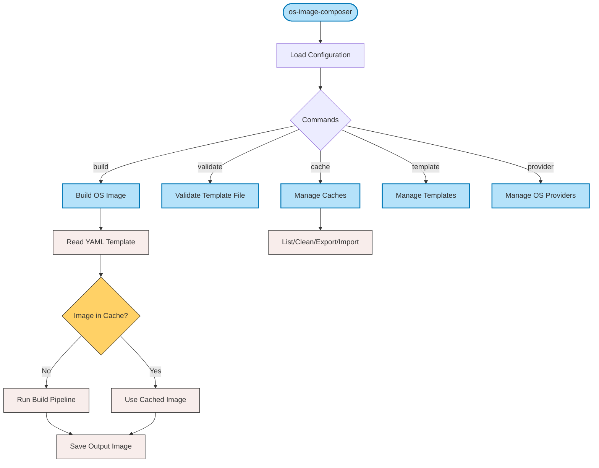

# OS Image Composer CLI Specification

## Table of Contents
- [OS Image Composer CLI Specification](#os-image-composer-cli-specification)
  - [Table of Contents](#table-of-contents)
  - [Overview](#overview)
  - [CLI Flow](#cli-flow)
  - [Usage](#usage)
  - [Global Options](#global-options)
  - [Commands](#commands)
    - [Build Command](#build-command)
    - [Validate Command](#validate-command)
    - [Cache Command](#cache-command)
    - [Template Command](#template-command)
  - [Examples](#examples)
    - [Building an Image](#building-an-image)
    - [Managing Cache](#managing-cache)
    - [Working with Templates](#working-with-templates)
  - [Configuration Files](#configuration-files)
    - [Global Configuration File](#global-configuration-file)
    - [Image Template File](#image-template-file)
  - [Exit Codes](#exit-codes)
  - [Troubleshooting](#troubleshooting)
    - [Common Issues](#common-issues)
    - [Logging](#logging)
  - [Related Documentation](#related-documentation)

## Overview

`os-image-composer` is a command-line tool for generating custom images for different operating systems, including [Azure Linux](https://github.com/microsoft/azurelinux), [Wind River eLxr](https://www.windriver.com/blog/Introducing-eLxr), and [Edge Microvisor Toolkit](https://github.com/open-edge-platform/edge-microvisor-toolkit). The tool provides a flexible approach to creating and configuring production-ready OS images with precise customization.

OS Image Composer uses a single CLI with subcommands to deliver a consistent user experience while maintaining flexibility. The tool's architecture is built around the following files:

1. A global configuration file that defines system-wide settings like cache locations and provider configurations
2. Image template files in YAML format that define per-image build requirements

The tool follows a staged build process to support package caching, image caching, and various customization options that speed up development cycles and ensure reproducible builds.

## CLI Flow

The following diagram illustrates the high-level flow of the OS Image Composer CLI, the commands of which begin with `os-image-composer`:



The primary workflow is through the `build` command, which reads an image template file, checks if an image matching those specifications is already cached, and either uses the cached image or runs the build pipeline to create a new image.  

See also:

- [How Caching Works](./os-image-composer-caching.md#how-they-work-together) for
details on the caching process
- [Build Stages](./os-image-composer-build-process.md#build-stages-in-detail) for the stages of the build pipeline

## Usage

```bash
os-image-composer [global options] command [command options] [arguments...]
```

## Global Options

The OS Image Composer command-line utility uses a layered configuration approach, with command-line options taking priority over the configuration file settings:

| Option | Description |
|--------|-------------|
| `--config FILE, -c FILE` | Global configuration file (default: /etc/os-image-composer/config.yaml). This file contains system-wide settings that apply to all image builds. |
| `--work-dir DIR` | Working directory for temporary build files (overrides config). This directory is where images are constructed before being finalized. |
| `--cache-dir DIR` | Cache directory for packages and previous builds (overrides config). Proper caching significantly improves build times. |
| `--log-level LEVEL` | Log level: debug, info, warn, error (overrides config). Use debug for troubleshooting build issues. |
| `--verbose, -v` | Verbose output (equivalent to --log-level debug). Displays detailed information about each step of the build process. |
| `--quiet, -q` | Minimal output (equivalent to --log-level error). Only displays errors, useful for scripted environments. |
| `--help, -h` | Show help for any command or subcommand. |
| `--version` | Show `os-image-composer` version information. |

## Commands

### Build Command

Build an OS image from an image template file. This is the primary command for creating custom OS images according to your requirements.

```bash
os-image-composer build [options] TEMPLATE_FILE
```

Options:

| Option | Description |
|--------|-------------|
| `--output-dir DIR, -o DIR` | Output directory for the finished image (default: ./output). Final images will be placed here with names based on the template. |
| `--force, -f` | Force overwrite existing files. By default, the tool will not overwrite existing images with the same name. |
| `--keep-temp` | Keep temporary files after build for debugging purposes. These are normally cleaned up automatically. |
| `--parallel N` | Run up to N parallel tasks (default: from config). Increases build speed on multi-core systems. |
| `--stage NAME` | Build up to specific stage and stop (e.g., "packages"). Useful for debugging or when you need a partially-built image. |
| `--skip-stage NAME` | Skip specified stage. Allows bypassing certain build phases when they're not needed. |
| `--timeout DURATION` | Maximum build duration (e.g., 1h30m). Prevents builds from running indefinitely due to issues. |
| `--variables FILE` | Load variables from YAML file to customize the build without modifying the template file. |
| `--set KEY=VALUE` | Set individual variable for the build (can be specified multiple times). |

See also:

- [Build Stages in Detail](./os-image-composer-build-process.md#build-stages-in-detail) for information about each build stage
- [Build Performance Optimization](./os-image-composer-build-process.md#build-performance-optimization) for tips to improve build speed

### Validate Command

Validate an image template file without building it. This allows checking for errors in your template before committing to a full build process.

```bash
os-image-composer validate [options] TEMPLATE_FILE
```

The `--merged` option validates the template after merging with defaults.  

See also:

- [Validate Stage](./os-image-composer-build-process.md#1-validate-stage) for details on the validation process

### Cache Command

Manage the image and package caches to optimize build performance and storage usage.

```bash
os-image-composer cache
```
See also:

- [Package Cache](./os-image-composer-caching.md#package-cache) and [Image Cache](./os-image-composer-caching.md#image-cache) for details on the caching mechanisms
- [Configuration Options](./os-image-composer-caching.md#configuration-options)

### Template Command

Manage image templates that serve as starting points for customized images.

```bash
os-image-composer template SUBCOMMAND
```

Subcommands:

| Subcommand | Description |
|------------|-------------|
| `list` | List available templates with descriptions and supported configurations. Templates provide ready-to-use base configurations for common image types. |
| `show TEMPLATE` | Show template details including all settings, variables, and customization options for a specific template. |
| `create TEMPLATE_FILE` | Create a new template from an existing template file, making it available for future use. |
| `export TEMPLATE FILE` | Export a template to a file for sharing with other users or systems. Templates can be version-controlled and distributed. |

See also:

- [What Are Templates](./os-image-composer-templates.md#what-are-templates)
- [Using Templates to Build Images](./os-image-composer-templates.md#using-templates-to-build-images)

## Examples

### Building an Image

```bash
# Build an image with default settings
os-image-composer build my-image-template.yml

# Build with custom global config
os-image-composer --config=/path/to/config.yaml build my-image-template.yml

# Build with variable substitution
os-image-composer build --set "version=1.2.3" --set "hostname=edge-device-001" my-image-template.yml

# Build up to a specific stage
os-image-composer build --stage configuration my-image-template.yml

# Build with a timeout
os-image-composer build --timeout 30m my-image-template.yml
```

### Managing Cache

```bash
# List cached images
os-image-composer cache list

# Clean package cache
os-image-composer cache clean --packages

# Export a cached image
os-image-composer cache export abc123def456 ./my-exported-image.qcow2
```

### Working with Templates

```bash
# List available templates
os-image-composer template list

# Show details for a template
os-image-composer template show ubuntu-server-22.04

# Create a new template from a template file
os-image-composer template create my-image-template.yml
```

## Configuration Files

### Global Configuration File

The global configuration file (YAML format) defines system-wide settings that apply to all image builds. This centralized configuration simplifies management of common settings across multiple image builds. To override the following settings with command-line options, see [Global Options](#global-options).

```yaml
core:
  # Core system settings
  cache_dir: "/var/cache/os-image-composer"     # Location for all cached data
  work_dir: "/var/tmp/os-image-composer"        # Temporary build workspace
  log_level: "info"                          # Default logging verbosity
  max_concurrent_builds: 4                   # Parallel build processes
  cleanup_on_failure: true                   # Auto-cleanup on build errors

storage:
  # Cache storage settings
  package_cache: 
    enabled: true                            # Enable package caching
    max_size_gb: 10                          # Maximum cache size
    retention_days: 30                       # How long to keep cached packages
  image_cache:
    enabled: true                            # Enable image caching
    max_count: 5                             # Number of images to keep per template

providers:
  # OS-specific provider configurations
  azure_linux:
    repositories:
      - name: "base"
        url: "https://packages.microsoft.com/azurelinux/3.0/prod/base/"
    
  elxr:
    repositories:
      - name: "main"
        url: "https://mirror.elxr.dev/elxr/dists/aria/main/"
    
  emt:
    repositories:
      - name: "edge-base"
        url: "https://files-rs.edgeorchestration.intel.com/files-edge-orch/microvisor/rpm/3.0/"
```

### Image Template File

The image template file (YAML format) defines the requirements for an image. With this file, you can define exactly what goes into your custom OS image, including packages, configurations, and customizations.

```yaml
image:
  # Basic image identification
  name: edge-device-image                    # Name of the resulting image
  version: "1.2.0"                           # Version for tracking and naming

target:
  # Target OS and image configuration
  os: azure-linux                            # Base operating system
  dist: azl3                                 # Distribution identifier
  arch: x86_64                               # Target architecture
  imageType: raw                             # Output format (raw, iso, img, vhd)

systemConfigs:
  # Array of system configurations
  - name: edge                               # Configuration name
    description: Edge device image with Microvisor support  # Human-readable description
    
    # Package configuration
    packages:                                # Packages to install
      - openssh-server
      - docker-ce
      - vim
      - curl
      - wget
    
    # Kernel configuration
    kernel:
      version: "6.12"                        # Kernel version to include
      cmdline: "quiet splash"                # Additional kernel command-line parameters
```

See also:

- [Common Build Patterns](./os-image-composer-build-process.md#common-build-patterns) for example image templates
- [Template Structure](./os-image-composer-templates.md#template-structure) for how to use templates to generate build specifications

## Exit Codes

The tool provides consistent exit codes that can be used in scripting and
automation:

| Code | Description |
|------|-------------|
| 0 | Success: The command completed successfully. |
| 1 | General error: An unspecified error occurred. |
| 2 | Command line usage error: Invalid options or arguments. |
| 3 | Validation error: The template file failed validation. |
| 4 | Build error: The build process failed. |
| 5 | Configuration error: Error in configuration files. |

## Troubleshooting

### Common Issues

1. **Disk Space**: Building images requires a significant amount of temporary disk space.

   ```bash
   # Check free space
   df -h /var/tmp/os-image-composer
   ```

1. **Cache Corruption**: If unexplained failures occur, try manually removing the content in the cache directory.

See also:

- [Troubleshooting Build Issues](./os-image-composer-build-process.md#troubleshooting-build-issues) for stage-specific troubleshooting

### Logging

Use detailed logs to troubleshoot issues:

```bash
# Enable debug logging
os-image-composer --log-level debug build my-image-template.yml

# Save logs to a file
os-image-composer --log-level debug build my-image-template.yml 2>&1 | tee build-log.txt
```

See also:

- [Build Log Analysis](./os-image-composer-build-process.md#build-log-analysis) for how to interpret log messages

## Related Documentation

- [Understanding the Build Process](./os-image-composer-build-process.md) describes the five-stage build pipeline.
- [Understanding Caching](./os-image-composer-caching.md) explains the package and image caching systems.
- [Understanding Templates in OS Image Composer](./os-image-composer-templates.md) demonstrates how to create and reuse templates.
