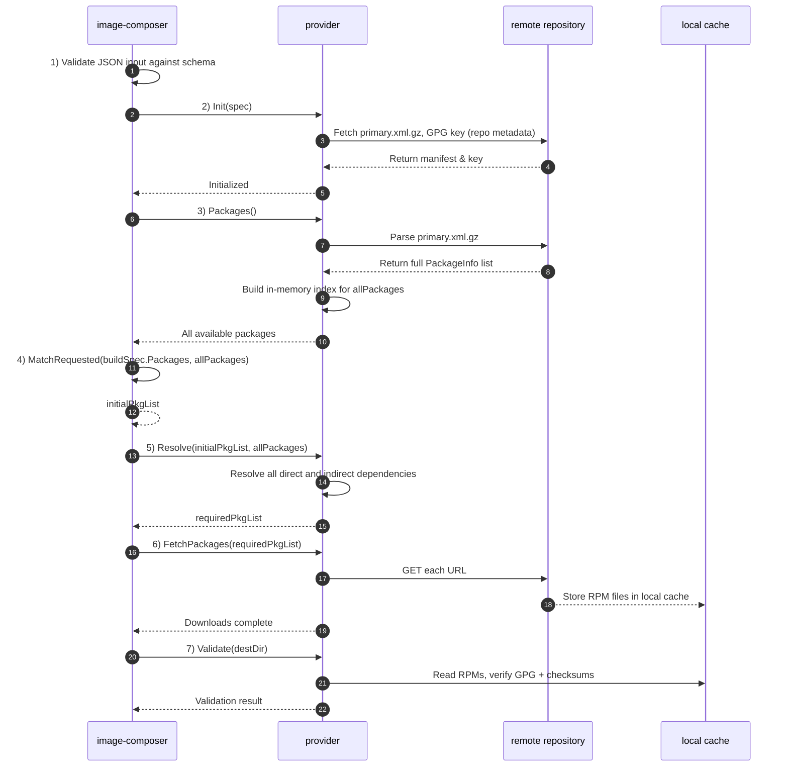

# Understanding the Image-Composer Build Process

This document explains the Image-Composer build process in detail, describing
how the tool creates customized OS images through a series of well-defined
stages. Understanding this process will help you optimize your image builds and
troubleshoot issues more effectively.

## Related Documentation

- [Understanding Caching in Image-Composer](./image-composer-caching.md) -
Details on package and image caching systems
- [Image-Composer CLI Specification](./image-composer-cli-specification.md) -
Complete command-line reference
- [Understanding Templates in Image-Composer](./image-composer-templates.md) -
How to use and create reusable templates

## Overview of the Build Pipeline

Image-Composer follows a staged build approach, splitting the image creation
process into discrete phases. This architecture provides several advantages:

- **Modularity**: Each stage has a specific responsibility
- **Caching**: Intermediate results can be cached for performance
- **Flexibility**: Stages can be skipped or limited for debugging
- **Extensibility**: New capabilities can be added to specific stages

The build process processes a build specification file through a series of
stages, each building upon the work of the previous stage. A build specification
(or build spec) is a YAML file that defines all requirements and configurations
for creating a custom OS image.

## Build Stages in Detail

The build process is divided into five sequential stages, each with its specific
responsibility:

### 1. Validate Stage

**Purpose**: Ensure the build specification is correct syntactically and valid
for the targeted provider before starting the build.

**Key Tasks**:

- Parse and validate the YAML specification syntax (YML is converted to JSON
and validated against a JSON schema definition)
- Verify that the referenced provider exists and is properly configured
- Check for the existence of required files (like custom scripts or
configuration files)
- Validate that the combination of settings is valid
- Ensure any specified templates exist and can be rendered properly

**Failure Handling**:

- If validation fails, the build is aborted immediately
- Errors are reported with specific details to help fix the issue

**Example Error Messages**:

```bash
Error: Missing required file './files/sshd_config' referenced in build spec
Error: Provider 'ubuntu' is not configured in the global configuration
Error: Invalid combination of compression 'gzip' with format 'vhd'
```

See also:

- [Validate Command](./image-composer-cli-specification.md#validate-command) for
validating build specifications without building

### 2. Package Download Stage

**Purpose**: Collect all packages required for the image and prepare them for
installation.

**Key Tasks**:

- Determine all packages required based on the specification
- Resolve package dependencies
- Check package cache for previously downloaded packages
- Download any missing packages
- Verify package integrity (authenticitiy and integrity checks)
- Store packages in the cache

**Package Caching**:

- During this stage, the package cache is heavily utilized
- Previously downloaded packages are reused when possible
- Downloaded packages are stored in the cache for future builds
- Package cache can be disabled using the `--no-package-cache` option

**Dependency Resolution**:

- Direct dependencies (specified in the build spec) are handled first
- Indirect dependencies (required by direct dependencies) are resolved
automatically
- Provider specific helper libraries are used to resolve these dependencies for
rpm and deb packages

The package staging is the first step of the image composer. During this stage
the image composer preparing the local environment to start the image
composition of the desired OS layout. Once this stage has completed the local
environment will have a pre-populated cache containing all required packages
necessary before entering the chroot environment and starting to compose the
image.

The following distinct steps are happening during the packaging stage.

1. The input build-spec JSON file is verified against the JSON schema definition
1. The desired distro provider is created and all its package manifest is
downloaded
1. The desired packages in the build-spec are validated to exist in the target
distribution
1. The dependency resolution checker is identifying all required dependencies
1. The required packages are downloaded to the local cache
1. The authenticitiy and integrity of every package required are validated in
the local cache



See also:

- [Package Cache](./image-composer-caching.md#package-cache) for details on
how package caching works and benefits build performance

### 3. Compose Stage

#### Image Creation
**Purpose**: Disk and filesystem preparation and install all packages.

**Key Tasks**:
- Create raw file, format partitions and filesystems
- Create empty raw file and create partitions according to the configs
- Format the partitions' filesystem

#### Generic System Installation

**Purpose**: Install OS packages

**Key Tasks**:
- Run pre-installation scripts
- Install OS packages, config general system config, general OS image installation
- Configure the base operating system environment
- Install all collected packages from the packages stage
- Configure network settings
- Set up user accounts
- Install and configure SSH keys
- Copy custom files to their destinations
- Enable or disable system services
- Configure bootloader options
- Run post-installation scripts

#### Security configuration
**Purpose**: Configure Security features

**Key Tasks**:
- Configure security related settings, for example: SELinux, LVM, secure boot, readonly filesystem, etc. 

### 4. Image Signing

**Purpose**: Sign the image

**Key Tasks**:
- Apply digital signatures for image integrity verification (if required)

See also:

- [Templates](./image-composer-templates.md#template-examples) for examples of
template-based configurations

### 5. Finalize Stage

#### Format Conversion
**Purpose**: Output format preparation

**Key Tasks**:
- Convert raw image to other required format
- Apply compression if specified
- According to the user config, convert the raw image to VHD/VHDX/qcow2, etc.

#### Manifest generation
**Purpose**: Generate manifest and SBOM 

**Key Tasks**:
- Generate manifest file
- Generate SBOM

#### Chache image

**Purpose**: Store it in the cache.

**Key Tasks**:
- Store the image in the image cache if enabled

**Output Formats**:

- Different output formats are supported (qcow2, raw, vhd, etc.)
- Format conversion is handled by provider-specific tools
- Compression options can be applied to reduce the final image size

**Image Caching**:

- The completed image is stored in the image cache based on a hash of the build
spec
- This enables instant retrieval of identical builds in the future
- Image caching can be disabled using the `--no-image-cache` option

See also:

- [Image Cache](./image-composer-caching.md#image-cache) for details on how
finished images are cached and reused

## Build Configuration Options

The build process can be customized with various configuration options:

### Global Configuration Options

These options affect all builds and are specified in the global configuration
file:

```yaml
core:
  cache_dir: "/var/cache/image-composer"     # Cache location
  work_dir: "/var/tmp/image-composer"        # Temporary build directory
  max_concurrent_builds: 4                   # Parallel build processes
  cleanup_on_failure: true                   # Auto-cleanup on build errors

storage:
  package_cache: 
    enabled: true                            # Master switch for package caching
    max_size_gb: 10                          # Maximum package cache size
    retention_days: 30                       # Package retention period
  image_cache:
    enabled: true                            # Master switch for image caching
    max_count: 5                             # Number of images to keep per spec
```

See also:

- [Global Configuration File](./image-composer-cli-specification.md#global-configuration-file)
for all available configuration options

### Build Specification Options

These options are specified in the build specification file and affect that
specific build:

```yaml
build:
  cache:
    use_package_cache: true                  # Whether to use package cache
    use_image_cache: true                    # Whether to use image cache
  stages:                                    # Build stages to include
    - validate
    - packages
    - compose
    - configuration
    - finalize
```

See also:

- [Build Specification File](./image-composer-cli-specification.md#build-specification-file)
for complete build specification format

### Command-Line Overrides

These options are specified on the command line and override both global and
specification options:

```bash
# Disable all caching for this build
image-composer build --no-cache my-image-spec.yml

# Build only up to the configuration stage
image-composer build --stage configuration my-image-spec.yml

# Skip the validate stage (not recommended in production)
image-composer build --skip-stage validate my-image-spec.yml

# Set a maximum build duration
image-composer build --timeout 30m my-image-spec.yml
```

See also:

- [Build Command](./image-composer-cli-specification.md#build-command) for all
available command line options

## Common Build Patterns

### Minimal System Image

For creating small, lean images with minimal packages:

```yaml
image:
  name: minimal-system
  base:
    os: ubuntu
    version: 22.04
    type: minimal

customizations:
  packages:
    install:
      - openssh-server
    remove:
      - snapd
      - cloud-init
```

### Development Environment Image

For creating images with development tools pre-installed:

```yaml
image:
  name: dev-environment
  base:
    os: ubuntu
    version: 22.04
    type: server

customizations:
  packages:
    install:
      - build-essential
      - git
      - docker-ce
      - python3-dev
```

### Production Server Image

For creating hardened production server images:

```yaml
image:
  name: production-web-server
  base:
    os: ubuntu
    version: 22.04
    type: server

customizations:
  packages:
    install:
      - nginx
      - ufw
      - fail2ban
  services:
    enabled:
      - nginx
      - ufw
      - fail2ban
  files:
    - source: ./files/hardened-sshd_config
      destination: /etc/ssh/sshd_config
    - source: ./files/ufw-config
      destination: /etc/ufw/ufw.conf
```

See also:

- [Template Examples](./image-composer-templates.md#template-examples) for how
these patterns can be templated

## Build Performance Optimization

### Improving Build Speed

1. **Enable Caching**:
   - Both package and image caching significantly improve build performance
   - Package caching speeds up similar builds
   - Image caching makes identical builds instant

2. **Increase Parallelism**:
   - Use the `--parallel` option to utilize multiple CPU cores
   - Adjust based on available CPU resources

3. **Optimize Working Directory**:
   - Place the working directory on fast storage (SSD)
   - Ensure adequate free space

See also:

- [Package Cache and Image Cache](./image-composer-caching.md#how-they-work-together)
for details on caching mechanisms

### Reducing Build Time for Development

1. **Build to Specific Stages**:
   - Use `--stage` to build only up to a particular stage
   - Useful for testing changes to early stages

2. **Use Templates**:
   - Create templates for common configurations
   - Derive new builds from templates to avoid repetitive configuration

3. **Keep Temporary Files**:
   - Use `--keep-temp` during development to avoid rebuilding from scratch
   - Examine temporary files to debug issues

See also:

- [Template Usage](./image-composer-templates.md#using-templates-to-build-images)
for streamlining development with templates

## Troubleshooting Build Issues

### Common Problems and Solutions

1. **Build Fails During Validate Stage**:
   - Check the build specification syntax
   - Verify all referenced files exist
   - Ensure the provider is properly configured

2. **Build Fails During Packages Stage**:
   - Check network connectivity
   - Verify repository URLs are correct
   - Ensure package names are correct
   - Try running with `--no-package-cache` to force fresh package downloads

3. **Build Fails During Compose Stage**:
   - Ensure enough disk space in the working directory
   - Check provider tool installation (debootstrap, yum, etc.)
   - Verify base OS version is supported

4. **Build Fails During Configuration Stage**:
   - Check custom script exit codes
   - Verify file paths and permissions
   - Look for conflicts in package configurations

5. **Build Fails During Finalize Stage**:
   - Ensure output directory is writable
   - Check for sufficient disk space
   - Verify output format tools are installed

### Detailed Debugging

1. **Increase Logging Verbosity**:

   ```bash
   image-composer --log-level debug build my-image-spec.yml
   ```

2. **Preserve Temporary Files**:

   ```bash
   image-composer build --keep-temp my-image-spec.yml
   ```

3. **Run to a Specific Stage**:

   ```bash
   image-composer build --stage compose my-image-spec.yml
   ```

4. **Skip Caching**:

   ```bash
   image-composer build --no-cache my-image-spec.yml
   ```

See also:

- [Troubleshooting](./image-composer-cli-specification.md#troubleshooting) for
CLI-specific troubleshooting techniques

### Build Log Analysis

Build logs can provide valuable information about failures. Key sections to check:

1. **Validation Errors**:
   - Look for "Validation error" messages at the beginning

2. **Package Resolution Issues**:
   - Look for "Failed to resolve dependencies" or "Package not found"

3. **Disk Space Warnings**:
   - Watch for "Insufficient disk space" messages

4. **Script Execution Failures**:
   - Check for "Script returned non-zero exit code"

5. **Permission Problems**:
   - Look for "Permission denied" errors

## Conclusion

The Image-Composer build process provides a flexible, staged approach to
creating customized OS images. By understanding each stage and its purpose, you
can create more efficient build specifications, troubleshoot issues more
effectively, and optimize the build process for your specific needs.

Key Takeaways:

1. **Staged Architecture**: The build process is broken into distinct stages
that can be controlled individually
2. **Caching System**: Both package and image caching improve performance
significantly
3. **Customization Options**: Multiple levels of configuration allow for precise
control
4. **Troubleshooting Tools**: Various command-line options facilitate debugging
and problem-solving
