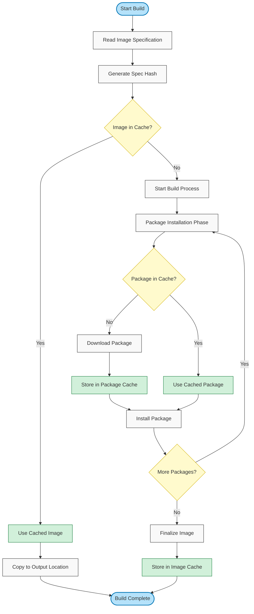

# Understanding Caching in Image-Composer

The Image-Composer tool implements two complementary caching mechanisms to significantly improve build performance and reduce resource usage: **Package Cache** and **Image Cache**. This document explains how these caching systems work and how to manage them effectively.

## Overview of Caching Mechanisms

Image-Composer uses a layered caching approach:

| Cache Type | Purpose | Performance Benefit |
|------------|---------|---------------------|
| Package Cache | Stores downloaded OS packages | Reduces network usage and download time |
| Image Cache | Stores complete built OS images | Eliminates entire build process for identical builds |

## Package Cache

### What Package Cache Does

The package cache stores downloaded OS packages (like .deb files for Ubuntu or .rpm files for Red Hat) to avoid re-downloading them for future builds.

### How Package Cache Works

1. **Before Package Download**:
   - When the build system needs to install a package, it first checks the cache
   - If the package exists in the cache, it uses the cached version
   - If not, it downloads the package, adds it to the cache, then uses it

1. **Key Characteristics**:
   - Organized by package name, version, architecture, and source repository
   - Each package is stored only once, regardless of how many image specs use it
   - Timestamps track when each package was last used

1. **Garbage Collection**:
   - Managed by two parameters:
     - Maximum size (in GB)
     - Retention time (in days)
   - When limits are reached, oldest and least-used packages are removed first

### Package Cache Benefits

- Dramatically reduces build time for similar images
- Decreases network bandwidth usage
- Enables building images without internet access (if packages were previously cached)
- Works even when image specifications change

## Image Cache

### What Image Cache Does

The image cache stores complete built OS images to skip the entire build process if an identical image specification has been built before.

### How Image Cache Works

1. **Before Building**:
   - The system generates a unique hash based on the entire image specification
   - It checks if an image with that hash exists in the cache
   - If found, it simply copies the cached image to the requested output location
   - If not found, it proceeds with the normal build process

1. **After Building**:
   - If image caching is enabled, the newly built image is stored in the cache
   - The specification hash serves as the cache key

1. **Cache Management**:
   - Controlled by a maximum image count parameter
   - When this limit is reached, least recently used images are removed

### Image Cache Benefits

- Provides instant results for repeated builds of the same image
- Ensures consistency across builds
- Enables quick testing of deployment procedures without rebuilding
- Particularly valuable in CI/CD pipelines and testing environments

## How They Work Together

The two caching mechanisms complement each other and operate at different levels:



This approach ensures:

1. **Maximum Performance**:
   - Identical builds are instant (image cache)
   - Similar builds still benefit from faster package installation (package cache)

2. **Resource Efficiency**:
   - Bandwidth usage is minimized
   - Disk space is managed automatically

3. **Flexibility**:
   - Each mechanism can be enabled/disabled independently

## Managing Caches via CLI

Image-Composer provides commands to manage both caching systems:

### Listing Cached Content

```bash
# List all cached images with metadata
image-composer cache list

# Get detailed information about a specific cached image
image-composer cache info abc123def456
```

### Cleaning Caches

```bash
# Clean package cache only
image-composer cache clean --packages

# Clean image cache only
image-composer cache clean --images

# Clean both caches completely
image-composer cache clean --all
```

### Exporting and Importing Cached Images

```bash
# Export a cached image to a file
image-composer cache export abc123def456 ./my-exported-image.qcow2

# Import an existing image into the cache
image-composer cache import ./my-image.qcow2
```

## Configuration Options

### Global Configuration (in config.yaml)

```yaml
storage:
  package_cache: 
    enabled: true              # Master switch for package caching
    max_size_gb: 10            # Maximum size for package cache
    retention_days: 30         # How long to keep unused packages
  image_cache:
    enabled: true              # Master switch for image caching
    max_count: 5               # Maximum number of images to keep
```

### Per-Image Specification (in image spec YAML)

```yaml
build:
  cache:
    use_package_cache: true    # Whether this build should use package cache
    use_image_cache: true      # Whether this build should use image cache
```

### Command-Line Overrides

```bash
# Disable all caching for a specific build
image-composer build --no-cache my-image-spec.yml

# Disable only package caching
image-composer build --no-package-cache my-image-spec.yml

# Disable only image caching
image-composer build --no-image-cache my-image-spec.yml
```

## Best Practices

1. **Keep Caching Enabled**:
   - The performance benefits are substantial
   - Cache management is automatic and requires minimal intervention

1. **Regular Cache Cleaning**:
   - Consider scheduling periodic cache cleaning in long-running environments
   - `image-composer cache clean --all` can be added to maintenance scripts

1. **Adjust Cache Sizes**:
   - For development environments with frequent builds, increase cache sizes
   - For CI/CD pipelines, tune based on disk space constraints

1. **Version Control Integration**:
   - Consider clearing image cache when major version control changes occur
   - This ensures images are rebuilt when repository content changes significantly

1. **CI/CD Optimization**:
   - In CI/CD environments, persist the cache between pipeline runs
   - Many CI systems support caching directories between jobs

1. **Troubleshooting**:
   - If encountering unexplained issues, try building with `--no-cache` first
   - This helps determine if a cached component is causing problems
