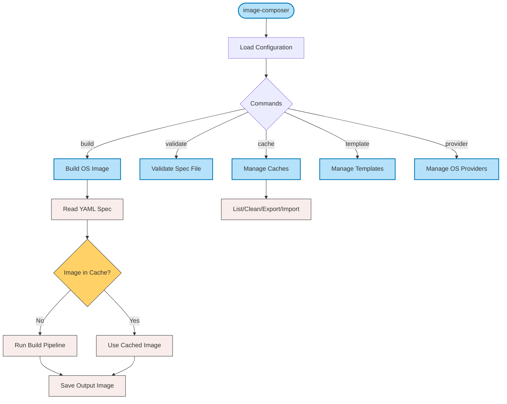

# Image-Composer CLI Specification

`image-composer` is a command-line tool for generating custom OS images for different operating systems including Edge Microvisor toolkit, Azure, Ubuntu, and Red Hat. It provides a flexible, configurability-first approach to creating production-ready OS images with precise customization.

## Overview

Image-Composer uses a single CLI with subcommands to provide a consistent user experience while maintaining flexibility. The tool's architecture is built around:

1. A global configuration file that defines system-wide settings like cache locations and provider configurations
2. Build specification files (in YAML format) that define per-image build requirements

The tool follows a staged build process, supporting package caching, image caching, and various customization options to speed up development cycles and ensure reproducible builds.

## CLI Flow

The following diagram illustrates the high-level flow of the Image-Composer CLI:



The primary workflow is through the `build` command, which reads an build specification file, checks if an image matching those specifications is already cached, and either uses the cached image or runs the build pipeline to create a new image.

## Usage

```bash
image-composer [global options] command [command options] [arguments...]
```

## Global Options

Image-Composer uses a layered configuration approach, with command-line options taking priority over configuration file settings:

| Option | Description |
|--------|-------------|
| `--config FILE, -c FILE` | Global configuration file (default: /etc/image-composer/config.yaml). This file contains system-wide settings that apply to all image builds. |
| `--work-dir DIR` | Working directory for temporary build files (overrides config). This is where images are constructed before being finalized. |
| `--cache-dir DIR` | Cache directory for packages and previous builds (overrides config). Proper caching significantly improves build times. |
| `--log-level LEVEL` | Log level: debug, info, warn, error (overrides config). Use debug for troubleshooting build issues. |
| `--verbose, -v` | Verbose output (equivalent to --log-level debug). Displays detailed information about each step of the build process. |
| `--quiet, -q` | Minimal output (equivalent to --log-level error). Only displays errors, useful for scripted environments. |
| `--help, -h` | Show help for any command or subcommand. |
| `--version` | Show Image-Composer version information. |

## Commands

### Build Command

Build an OS image from a specification file. This is the primary command for creating custom OS images according to your requirements.

```bash
image-composer build [options] SPEC_FILE
```

Options:

| Option | Description |
|--------|-------------|
| `--output-dir DIR, -o DIR` | Output directory for the finished image (default: ./output). Final images will be placed here with names based on the specification. |
| `--force, -f` | Force overwrite existing files. By default, the tool will not overwrite existing images with the same name. |
| `--no-cache` | Disable all caching mechanisms (both package and image caching). Useful when you need a completely fresh build. |
| `--no-package-cache` | Disable package caching only. Packages will be downloaded fresh each time, but previous image builds might still be used. |
| `--no-image-cache` | Disable image caching only. Previous built images won't be reused, but package cache will still be utilized. |
| `--keep-temp` | Keep temporary files after build for debugging purposes. These are normally cleaned up automatically. |
| `--parallel N` | Run up to N parallel tasks (default: from config). Increases build speed on multi-core systems. |
| `--stage NAME` | Build up to specific stage and stop (e.g., "packages"). Useful for debugging or when you need a partially-built image. |
| `--skip-stage NAME` | Skip specified stage. Allows bypassing certain build phases when they're not needed. |
| `--timeout DURATION` | Maximum build duration (e.g., 1h30m). Prevents builds from running indefinitely due to issues. |
| `--variables FILE` | Load variables from YAML file to customize the build without modifying the spec file. |
| `--set KEY=VALUE` | Set individual variable for the build (can be specified multiple times). |

### Validate Command

Validate an build specification file without building it. This allows checking for errors in your specification before committing to a full build process.

```bash
image-composer validate [options] SPEC_FILE
```

Options:

| Option | Description |
|--------|-------------|
| `--schema-only` | Only validate YAML schema without checking filesystem dependencies or provider compatibility. This performs a quick validation of the syntax only. |
| `--strict` | Enable strict validation with additional checks. Enforces best practices and checks for potential issues that might not cause immediate errors. |
| `--list-warnings` | Show all warnings, including minor issues that might not prevent the build. Helpful for creating more robust specification files. |

### Cache Command

Manage the image and package caches to optimize build performance and storage usage. Detailed documentation at [Understanding Caching in Image-Composer](https://github.com/intel-innersource/os.linux.tiberos.os-curation-tool/tree/main/docs/image-composer-caching.md)

```bash
image-composer cache SUBCOMMAND
```

Subcommands:

| Subcommand | Description |
|------------|-------------|
| `list` | List cached images with their metadata, timestamps, and storage locations. Helps you understand what's already cached and available for reuse. |
| `info [hash]` | Show detailed cache info for a specific image hash, including build parameters and spec details. |
| `clean [--all\|--packages\|--images]` | Clean cache to reclaim disk space. You can selectively clean either packages or images, or both with --all. |
| `export [hash] FILE` | Export a cached image to a specific file location. Useful when you need to retrieve a specific cached build. |
| `import FILE` | Import an existing image into the cache. Allows pre-populating the cache with images built elsewhere. |

### Template Command

Manage image templates that serve as starting points for customized images.

```bash
image-composer template SUBCOMMAND
```

Subcommands:

| Subcommand | Description |
|------------|-------------|
| `list` | List available templates with descriptions and supported configurations. Templates provide ready-to-use base configurations for common image types. |
| `show TEMPLATE` | Show template details including all settings, variables, and customization options for a specific template. |
| `create SPEC_FILE` | Create a new template from an existing specification file, making it available for future use. |
| `export TEMPLATE FILE` | Export a template to a file for sharing with other users or systems. Templates can be version-controlled and distributed. |

### Provider Command

Manage OS providers used to build images for different operating systems.

```bash
image-composer provider SUBCOMMAND
```

Subcommands:

| Subcommand | Description |
|------------|-------------|
| `list` | List configured providers with their status and capabilities. Shows all available OS providers that can be used for image building. |
| `config PROVIDER` | Show provider configuration details including repository URLs, tools, and default settings for a specific provider. |
| `test PROVIDER` | Test provider configuration by verifying dependencies and connectivity. Ensures the provider is properly configured before attempting a build. |

## Examples

### Building an Image

```bash
# Build an image with default settings
image-composer build my-image-spec.yml

# Build with custom global config
image-composer --config=/path/to/config.yaml build my-image-spec.yml

# Build with variable substitution
image-composer build --set "version=1.2.3" --set "hostname=edge-device-001" my-image-spec.yml

# Build up to a specific stage
image-composer build --stage configuration my-image-spec.yml

# Build with a timeout
image-composer build --timeout 30m my-image-spec.yml
```

### Managing Cache

```bash
# List cached images
image-composer cache list

# Clean package cache
image-composer cache clean --packages

# Export a cached image
image-composer cache export abc123def456 ./my-exported-image.qcow2
```

### Working with Templates

```bash
# List available templates
image-composer template list

# Show details for a template
image-composer template show ubuntu-server-22.04

# Create a new template from a spec file
image-composer template create my-image-spec.yml
```

## Configuration Files

### Global Configuration File

The global configuration file (YAML format) defines system-wide settings that apply to all image builds. This centralized configuration simplifies management of common settings across multiple image builds.

```yaml
core:
  # Core system settings
  cache_dir: "/var/cache/image-composer"     # Location for all cached data
  work_dir: "/var/tmp/image-composer"        # Temporary build workspace
  log_level: "info"                          # Default logging verbosity
  max_concurrent_builds: 4                   # Parallel build processes
  cleanup_on_failure: true                   # Auto-cleanup on build errors

storage:
  # Cache storage settings
  package_cache: 
    enabled: true                            # Enable package caching
    max_size_gb: 10                          # Maximum cache size
    retention_days: 30                       # How long to keep cached packages
  image_cache:
    enabled: true                            # Enable image caching
    max_count: 5                             # Number of images to keep per spec

providers:
  # OS-specific provider configurations
  ubuntu:
    repositories:
      - name: "main"
        url: "http://archive.ubuntu.com/ubuntu/"
    debootstrap_path: "/usr/sbin/debootstrap" # Path to debootstrap tool
  
  redhat:
    repositories:
      - name: "base"
        url: "https://cdn.redhat.com/content/dist/rhel8/8/x86_64/baseos/os"
    
  azure:
    cli_path: "/usr/bin/az"                  # Path to Azure CLI
    gallery_resource_group: "image-gallery-rg" # Azure resource group for images
    
  edge_microvisor:
    toolkit_source: "https://download.edge-microvisor.io/toolkit/" # Toolkit location
    secure_boot_keys_dir: "/etc/image-composer/secure-keys/" # Secure boot key location
```

### Build Specification File

The build specification file (YAML format) defines the requirements for a specific image. This is where you define exactly what goes into your custom OS image, including packages, configurations, and customizations.

```yaml
image:
  # Basic image identification
  name: edge-device-image                    # Name of the resulting image
  version: 1.2.0                             # Version for tracking and naming
  description: Edge device image with Microvisor support  # Human-readable description
  base:
    os: ubuntu                               # Base operating system
    version: 22.04                           # OS version
    type: minimal                            # OS variant (minimal, server, desktop)

build:
  # Build process configuration
  cache:
    use_package_cache: true                  # Whether to use the package cache
    use_image_cache: true                    # Whether to use the image cache
  stages:                                    # Build stages in sequence
    - base                                   # Creates the base OS
    - packages                               # Installs required packages
    - configuration                          # Applies configurations
    - finalize                               # Finalizes the image

customizations:
  # OS customizations
  packages:
    install:                                 # Packages to install
      - openssh-server
      - docker-ce
    remove:                                  # Packages to remove
      - snapd
  services:
    enabled:                                 # Services to enable on boot
      - ssh
      - docker
    disabled:                                # Services to disable
      - apparmor
  files:                                     # Custom files to add to the image
    - source: ./files/sshd_config            # Path to source file (relative to spec)
      destination: /etc/ssh/sshd_config      # Path in the target image
      permissions: 0644                      # File permissions
      owner: root:root                       # File ownership
  scripts:                                   # Scripts to run during build
    - path: ./scripts/setup-networking.sh    # Path to script (relative to spec)
      args:                                  # Arguments to pass to the script
        - --interface
        - eth0
      run_in_chroot: true                    # Whether to run in chroot environment

output:
  # Output settings
  format: qcow2                              # Output format (qcow2, raw, vhd)
  compression: gzip                          # Compression algorithm
  destination: ./output/                     # Output directory override
```

## Exit Codes

The tool provides consistent exit codes that can be used in scripting and automation:

| Code | Description |
|------|-------------|
| 0 | Success - The command completed successfully |
| 1 | General error - An unspecified error occurred |
| 2 | Command line usage error - Invalid options or arguments |
| 3 | Validation error - The specification file failed validation |
| 4 | Build error - The build process failed |
| 5 | Configuration error - Error in configuration files |

## Troubleshooting

### Common Issues

1. **Disk Space**: Building images requires significant temporary disk space.
   ```bash
   # Check free space
   df -h /var/tmp/image-composer
   ```

1. **Cache Corruption**: If you experience unexplained failures, try clearing the cache.
   ```bash
   image-composer cache clean --all
   ```

### Logging

For detailed logs to troubleshoot issues:

```bash
# Enable debug logging
image-composer --log-level debug build my-image-spec.yml

# Save logs to a file
image-composer --log-level debug build my-image-spec.yml 2>&1 | tee build-log.txt
```

